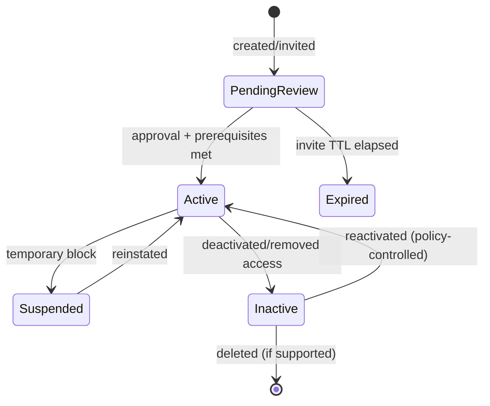
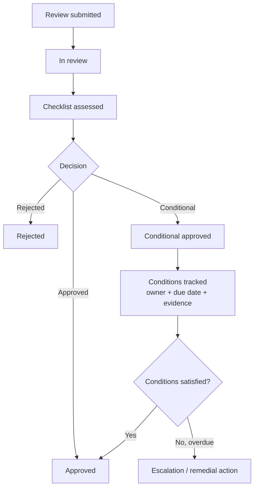
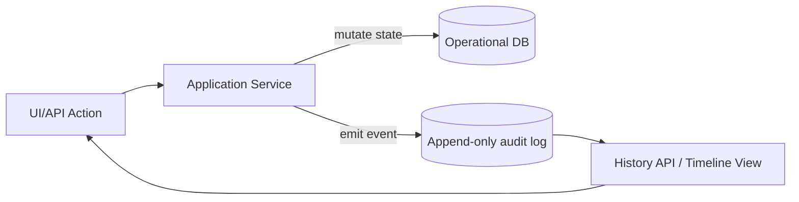

# Public-source evidence findings for savedRun research packets

## Executive summary

Across the ten decision packets, publicly available sources are **strong and consistent** for identity, access control, and auditability patterns (standards and major vendor/OSS docs converge on staged activation, stable IDs, many-to-many RBAC, and event-focused audit records). Evidence is **moderate** for Shariah-governance–specific submission metadata: core governance expectations (documented submissions, written opinions, audit/review reporting, record retention, remedial timelines) are well supported by Islamic finance standards and law, but **field-level “required metadata templates” are not uniformly standardized in public references**. The highest-impact next research priorities are: (a) obtain and extract any regulator-issued Shariah governance submission templates that are publicly available but difficult to fetch automatically (notably certain central-bank policy PDFs), (b) find public examples of Shariah committee “submission packs” and “conditions tracking” used by issuers/IFIs to map required fields to your acceptance criteria, and (c) confirm how your target deployment context intends to use global legal-entity identifiers (e.g., LEI) vs jurisdictional registration numbers for uniqueness.

## Research approach and scope

Sources were limited to **public and released** materials, prioritized as: (1) standards and official publications (e.g., entity["organization","NIST","us standards body"] controls; entity["organization","IETF","internet standards body"] RFCs; entity["organization","International Organization for Standardization","standards body"] summaries), (2) major security guidance (entity["organization","OWASP","web security project"]), (3) major OSS/vendor documentation (e.g., entity["organization","Kubernetes","container orchestration project"] RBAC; entity["company","Amazon Web Services","cloud provider"] S3 presigned URLs; entity["company","Microsoft","software company"] Graph upload sessions; entity["company","Okta","identity platform"] account states; entity["company","GitHub","code hosting platform"] SCIM deprovisioning), and (4) Islamic-finance governance standards and statutes (e.g., entity["organization","Islamic Financial Services Board","islamic finance standards"] and entity["country","Malaysia","country in southeast asia"] legislation).

## Packet findings

**Packet Q-01 — Membership lifecycle default state (initial status and gating)**  
*Restated packet question:* For a newly created member organization (or equivalent “membership”), should the default state be immediately active, or should it start in a gated state (e.g., pending review / invited / staged) until approvals or prerequisites are satisfied?

- **Evidence:** NIST account management control guidance explicitly includes “require approvals… for requests to create accounts” and managing create/enable/disable/remove accounts under defined criteria. This is an authoritative pattern favoring **gated enablement** rather than implicit activation. [NIST SP 800-53 AC-2] citeturn24search3  
  **Why this matters:** Supports acceptance criteria for **approval gates** and aligns with Sprint planning PBIs that depend on “pendingReview vs active” behavior (e.g., member org schema + workflow).

- **Evidence:** SCIM defines an `active` attribute as a boolean administrative status; a “typical example” is `true` = can log in, `false` = suspended. The “definitive meaning… is determined by the service provider,” indicating standards support **explicit status fields** while leaving your product decision open. [RFC 7643] citeturn6view1  
  **Why this matters:** Maps to acceptance criteria requiring a **visible state field** and predictable effects (login/access allowed vs suspended), without forcing a single default.

- **Evidence:** Okta documents multiple user lifecycle states including **STAGED** (new, not activated) and **PROVISIONED/PENDING USER ACTION** before ACTIVE, showing a widely used enterprise identity model with **pre-active states**. [Okta support doc on user statuses] citeturn9search5  
  **Why this matters:** Provides an industry precedent for a “pendingReview/staged” initial state that is operationally common and helps avoid granting access prematurely.

- **Evidence:** Okta additionally distinguishes **Suspended** vs **Deprovisioned (Deactivated)** states: suspended blocks access while keeping profile updatable; deprovisioned removes app assignments and deletes passwords. [Okta Classic Engine user states] citeturn9search1  
  **Why this matters:** Helps define acceptance criteria around **inactive vs suspended vs deleted** semantics and the “what remains editable/visible” matrix.

- **Evidence:** GitHub organization invitations are explicitly “pending” until accepted, and invitations can expire (seven days). This supports an invitation-based membership model where “membership exists but is not yet active.” [GitHub Docs: inviting users] citeturn9search15  
  **Why this matters:** Provides a concrete, public example for downstream PBIs involving **invitation flows**, “pending lists,” and automatic expiry behaviors.

- **Evidence:** OWASP identifies “deny by default / least privilege” violations as a common access control failure category; implicit availability of privileged actions is a known risk pattern. [OWASP Top 10 A01 Broken Access Control] citeturn8search20  
  **Why this matters:** Reinforces acceptance criteria that initial state should not grant write/privileged capabilities until explicitly allowed.

**Gaps / missing public info:** Public sources do not decide *your* product’s default; they show patterns. If your domain requires regulator-style onboarding checks, public domain specifics may exist but are jurisdictional and not uniform.

| Source | Type | Key evidence | URL |
|---|---|---|---|
| NIST SP 800-53 (AC-2 Account Management) | Standard/control catalog | approvals for account creation; create/enable/disable by policy & criteria | https://csf.tools/reference/nist-sp-800-53/r5/ac/ac-2/ |
| Okta user status documentation | Vendor docs | staged/provisioned/active + suspended/deprovisioned lifecycle | https://support.okta.com/help/s/article/how-to-understand-the-different-user-statuses-in-the-admin-console?language=en_US |
| GitHub org invitations | Vendor docs | invitations pending until accepted; expiry behavior | https://docs.github.com/en/organizations/managing-membership-in-your-organization/inviting-users-to-join-your-organization |

Mermaid (illustrative lifecycle pattern aligned to the evidence; *not a decision*):

**Packet Q-02 — Membership uniqueness and ID strategy (legal-entity identifiers and stable internal IDs)**  
*Restated packet question:* What identifiers should define uniqueness for an organization (e.g., registration number; jurisdiction + registration number; LEI), and how should internal IDs relate to externally meaningful IDs?

- **Evidence:** ISO describes ISO 17442-1 (LEI) as applicable to “legal entities” responsible for financial transactions or able to enter into contracts, indicating a recognized approach for identifying organizations in regulated contexts. [ISO 17442-1 overview] citeturn24search0  
  **Why this matters:** Supports acceptance criteria that a member organization may need a **globally meaningful identifier field** (or at least a design accommodating it), especially if your system interacts with financial-market ecosystems.

- **Evidence:** GLEIF states an LEI is a **unique 20-character** alphanumeric code; “Every LEI is unique and can represent only one entity.” [GLEIF LEI introduction] citeturn24search1  
  **Why this matters:** Directly supports uniqueness acceptance criteria when considering LEI as a canonical uniqueness key (or as a strong secondary key).

- **Evidence:** SWIFT describes the LEI as the international ISO 17442 standard enabling consistent identification of legal entities, linking to “critical information” about the entity. [SWIFT LEI overview] citeturn24search4  
  **Why this matters:** Reinforces the “uniqueness + reference data” rationale, useful for downstream PBIs that require display of legal entity profile data and credible verification.

- **Evidence:** The U.S. Office of Financial Research explains LEI as a barcode-like reference code used across markets and jurisdictions to uniquely identify legally distinct entities. [OFR LEI FAQ] citeturn24search30  
  **Why this matters:** Provides another authoritative framing that LEI is intended specifically for **cross-jurisdiction uniqueness**, helpful if your membership includes international entities.

- **Evidence:** SCIM requires the server-issued `id` to be unique across the service provider’s entire set of resources, stable, non-reassignable, and not client-specified. [RFC 7643 `id` attribute] citeturn25view0  
  **Why this matters:** Strongly supports acceptance criteria for an internal `id` that is **opaque/stable** for referential integrity, independent of mutable external business identifiers.

- **Evidence:** SCIM defines `externalId` as a client-defined identifier scoped to the provisioning domain and explicitly discusses avoiding local mapping and limiting correlation across domains/tenants. [RFC 7643 `externalId` attribute + privacy notes] citeturn25view1  
  **Why this matters:** Maps to acceptance criteria around storing both (a) stable internal IDs and (b) external business identifiers (registration number, LEI) with clear **scope and correlation controls**.

- **Evidence:** Microsoft Entra’s SCIM guidance states that (by default) users are retrieved by `id` and queried by `username`/`externalId`, showing a real-world operational pattern: stable internal ID + queryable business identifiers. [Microsoft Entra SCIM tutorial] citeturn24search9  
  **Why this matters:** Supports downstream PBIs for search/filter endpoints and admin operations depending on “lookup by registrationNumber / externalId.”

- **Evidence:** NIST AC-2 requires account creation/enabling aligned to prerequisites and criteria; this supports the idea that “uniqueness identifiers” should be validated as prerequisites before activation. [NIST SP 800-53 AC-2] citeturn24search3  
  **Why this matters:** Links uniqueness fields to lifecycle gating (e.g., cannot activate without validated identifiers).

**Gaps / missing public info:** ISO full-text details are typically paywalled; public summaries do not prescribe whether your system *must* require LEI. Jurisdiction-specific “registration number” rules differ by country; additional targeted regulatory sources may be needed to define mandatory fields by jurisdiction.

| Source | Type | Key evidence | URL |
|---|---|---|---|
| ISO 17442-1 overview page | Standard summary | LEI applies to legal entities that can transact/contract | https://www.iso.org/standard/78829.html |
| GLEIF LEI introduction | Official operating foundation docs | LEI is unique; represents only one entity; 20-character code | https://www.gleif.org/en/about-lei/introducing-the-legal-entity-identifier-lei |
| RFC 7643 (SCIM Core Schema) | IETF standard | stable server-issued id; scoped externalId for cross-domain mapping | https://datatracker.ietf.org/doc/html/rfc7643 |

**Packet Q-03 — User identity model (token claims, uniqueness, user lifecycle statuses)**  
*Restated packet question:* How should “user identity” be represented (e.g., OIDC subject, SCIM identifiers), and how should lifecycle status (active/suspended/deprovisioned) inform authorization and audit?

- **Evidence:** JWT RFC lists registered claim names and stresses none are globally mandatory; applications define which claims are required. This supports designing an explicit “required claims” contract (e.g., `sub`, `iss`, `exp`). [RFC 7519] citeturn6view2  
  **Why this matters:** Maps to acceptance criteria for authentication middleware and request context (what your app requires from identity tokens).

- **Evidence:** JWT RFC specifies `sub` “MUST either be scoped to be locally unique in the context of the issuer or be globally unique.” [RFC 7519 `sub`] citeturn6view3  
  **Why this matters:** Supports using issuer-scoped stable subject IDs to join user → assignments → audit events, aligned to user identity PBIs.

- **Evidence:** JWT RFC specifies the `exp` claim defines the time after which the JWT “MUST NOT be accepted,” requiring current time checks. [RFC 7519 `exp`] citeturn6view4  
  **Why this matters:** Supports acceptance criteria around session validity, re-auth flow, and accurate audit attribution (“token valid at time of action”).

- **Evidence:** OpenID Connect Core is explicitly an identity layer over OAuth 2.0 and uses ID Tokens (JWTs) to convey authentication information. [OpenID Connect Core] citeturn5search2  
  **Why this matters:** Supports separating “authentication identity” from your internal role/permission model, reducing ambiguity in user identity semantics.

- **Evidence:** OAuth 2.0 describes obtaining limited access to HTTP services (authorization framework). [OAuth 2.0 RFC 6749] citeturn5search1  
  **Why this matters:** Helps align acceptance criteria for API authorization (access tokens) vs user identity (ID tokens), particularly when audit records must represent “who did what.”

- **Evidence:** SCIM `active` attribute defines an administrative status; typical example ties `true` to login enabled and `false` to suspended. [RFC 7643 `active`] citeturn6view1  
  **Why this matters:** Provides a standards-backed model for enforcing deactivation and for “protected functions” logic.

- **Evidence:** Okta documents multiple lifecycle states including staged/provisioned/active and suspended/deprovisioned, showing a practical enterprise identity lifecycle taxonomy. [Okta user states] citeturn9search1turn9search5  
  **Why this matters:** Supports acceptance criteria distinguishing reversible suspension vs deeper deprovisioning, and informs UI/API state sets.

- **Evidence:** GitHub Enterprise deprovisioning via SCIM suspends the user; “a deprovisioned account is never deleted from an enterprise,” preserving audit/history while removing access. [GitHub: deprovisioning and reinstating users] citeturn9search12  
  **Why this matters:** Supports downstream PBIs around historical visibility, non-destructive deactivation, and auditability requirements.

**Gaps / missing public info:** Public standards don’t dictate whether you require OIDC only vs allow local accounts. Additional product constraints (offline mode, admin break-glass) may require more targeted research.

| Source | Type | Key evidence | URL |
|---|---|---|---|
| RFC 7519 (JWT) | IETF standard | sub uniqueness; exp enforcement; registered claims guidance | https://datatracker.ietf.org/doc/html/rfc7519 |
| OpenID Connect Core | Industry specification | ID Token = JWT containing authentication claims | https://www.itu.int/epublications/publication/itu-t-x-1285-2025-05-openid-connect-core-1-0-errata-set-2 |
| RFC 7643 (SCIM Core Schema) | IETF standard | active status semantics; stable id; externalId | https://datatracker.ietf.org/doc/html/rfc7643 |

**Packet Q-04 — Role catalog design (role scope, status, and permission aggregation model)**  
*Restated packet question:* What should a “role” represent (permissions bundle), how should scope be modeled (org-scoped vs global), and what should happen when roles are inactivated?

- **Evidence:** OWASP defines RBAC as roles assigned to users; permissions associated with roles; users can have multiple roles (many-to-many) and roles may be hierarchical. [OWASP Authorization Cheat Sheet] citeturn8search1  
  **Why this matters:** Supports acceptance criteria for role catalog fundamentals: role→permissions mapping, and potentially role hierarchy or at least many-to-many assignments.

- **Evidence:** Kubernetes RBAC describes RoleBinding/ClusterRoleBinding: bindings hold subjects and a references to a role; RoleBinding grants permissions within a namespace; ClusterRoleBinding grants cluster-wide access. [Kubernetes RBAC docs] citeturn7search0  
  **Why this matters:** Offers a widely adopted OSS precedent for **explicit scope** separation (local vs global) and for modeling “binding” as separate from “role definition.”

- **Evidence:** OpenShift RBAC API states RoleBinding references a role but does not contain it, adds “who information via Subjects,” and is namespace-scoped. [OpenShift RoleBinding API] citeturn7search8  
  **Why this matters:** Helps justify acceptance criteria that role definitions remain stable reference data while assignments/bindings capture “who + scope + time.”

- **Evidence:** AWS IAM evaluation logic indicates explicit deny overrides allow and that access is denied by default unless allowed by relevant policies. [AWS IAM policy evaluation] citeturn7search5turn7search1  
  **Why this matters:** Provides a public precedent for deterministic permission evaluation rules if your role catalog includes overlapping permissions or “deny” semantics.

- **Evidence:** OWASP’s least privilege principle emphasizes granting minimum permissions necessary. [OWASP: Least Privilege Principle] citeturn8search12  
  **Why this matters:** Supports acceptance criteria that role catalog should avoid overly broad “god roles,” and adds rationale for a small set of high-privilege roles with stronger gates/audit.

- **Evidence:** ANSI/INCITS 359-2004 (RBAC) is described as defining a reference model for RBAC elements (users, roles, permissions, operations, objects) and functional specs for RBAC systems. [ANSI webstore summary] citeturn26search15  
  **Why this matters:** Supports role model acceptance criteria and provides a canonical vocabulary to align your data model with recognized RBAC constructs.

- **Evidence (inference supported by sources):** If bindings grant permissions defined by roles (Kubernetes/OpenShift), then multiple bindings likely result in additive permissions unless an explicit deny mechanism exists (AWS model shows deny precedence). [Kubernetes RBAC docs; AWS policy evaluation] citeturn7search0turn7search5turn7search1  
  **Why this matters:** Directly maps to acceptance criteria for multi-role users and conflict resolution logic used by authorization middleware.

**Gaps / missing public info:** Public sources do not define your domain-specific role inventory (e.g., “Shariah Reviewer,” “Org Admin”). You’ll still need product-level role enumeration and a permissions matrix.

| Source | Type | Key evidence | URL |
|---|---|---|---|
| OWASP Authorization Cheat Sheet | Security guidance | RBAC model; many-to-many users↔roles; role hierarchy concept | https://cheatsheetseries.owasp.org/cheatsheets/Authorization_Cheat_Sheet.html |
| Kubernetes RBAC documentation | Major OSS docs | roles + bindings; namespace vs cluster scope | https://kubernetes.io/docs/reference/access-authn-authz/rbac/ |
| ANSI/INCITS 359-2004 (RBAC) summary | Standard catalog entry | reference model elements + functional spec for RBAC systems | https://webstore.ansi.org/standards/incits/ansiincits3592004 |

**Packet Q-05 — Assignment multiplicity and conflict/precedence rules**  
*Restated packet question:* Can one user hold multiple roles in one organization at once, and if so, how are permissions combined and conflicts resolved?

- **Evidence:** OWASP notes RBAC user-role relationships are generally many-to-many. [OWASP Authorization Cheat Sheet] citeturn8search1  
  **Why this matters:** Supports acceptance criteria allowing multiple assignments without treating it as an edge case, and aligns with PBIs defining assignment rules.

- **Evidence:** Kubernetes RBAC states a RoleBinding grants permissions to “a user or set of users,” holding a list of subjects and a reference to the role. This structurally supports many-to-many mapping via multiple bindings. [Kubernetes RBAC docs] citeturn7search0  
  **Why this matters:** Supports implementing assignment multiplicity as first-class and informs API schema (bindings/assignments as separate resources).

- **Evidence:** OpenShift RoleBinding reinforces that RoleBinding references Role/ClusterRole and is only effective in its namespace. [OpenShift RoleBinding API] citeturn7search8  
  **Why this matters:** Maps to acceptance criteria about **scope-limited assignments**, especially if your system is multi-tenant by organization.

- **Evidence:** AWS IAM’s evaluation model is explicit about precedence: explicit deny overrides allow; default is implicit deny. [AWS IAM evaluation logic] citeturn7search5turn7search1  
  **Why this matters:** Provides a public, well-understood precedent for conflict resolution if you introduce negative permissions or “blocking” conditions.

- **Evidence:** NIST AC-2 markup highlights “establish conditions for group and role membership,” implying assignment is policy constrained. [NIST 800-53 draft controls markup] citeturn24search26  
  **Why this matters:** Supports acceptance criteria that assignment validity must be checked against prerequisites (active org, active user, active role, etc.).

- **Evidence:** SCIM’s identification split (`id` vs `externalId`) supports consistent assignment references and avoids brittle joins on mutable identifiers (like emails). [RFC 7643 `id` and `externalId`] citeturn25view0turn25view1  
  **Why this matters:** Supports downstream PBIs for assignment uniqueness constraints (e.g., “no duplicate active assignment for same user+role+org” using stable IDs).

- **Evidence:** OWASP A01 describes broken access control risks when access is granted too broadly; this implies multi-role scenarios must be carefully bounded (least-privilege) and tested. [OWASP Top 10 A01] citeturn8search20  
  **Why this matters:** Maps to acceptance criteria requiring negative test cases (ensuring permission creep doesn’t happen when adding roles).

**Gaps / missing public info:** Public sources don’t choose “single role only” vs “multi-role.” If your domain requires separation-of-duties constraints (e.g., requester cannot approve), additional research on RBAC constraints/SoD in ANSI RBAC may be needed.

| Source | Type | Key evidence | URL |
|---|---|---|---|
| OWASP Authorization Cheat Sheet | Security guidance | many-to-many role assignment; RBAC fundamentals | https://cheatsheetseries.owasp.org/cheatsheets/Authorization_Cheat_Sheet.html |
| Kubernetes RBAC docs | Major OSS docs | bindings with subjects; scope separation | https://kubernetes.io/docs/reference/access-authn-authz/rbac/ |
| AWS IAM evaluation logic | Vendor docs | explicit deny precedence; default deny | https://docs.aws.amazon.com/IAM/latest/UserGuide/reference_policies_evaluation-logic.html |

**Packet Q-06 — Deactivation and protected functions (what must be blocked, what remains visible)**  
*Restated packet question:* When an organization/user/role is inactive, what operations must be blocked (write actions, approvals, submissions), what may remain readable for audit/history, and what must be logged?

- **Evidence:** NIST AC-2 includes full lifecycle account management (create/enable/disable/remove) and approvals for creation. [NIST SP 800-53 AC-2] citeturn24search3  
  **Why this matters:** Supports acceptance criteria that disable/revoke actions are first-class operations with approvals and audit expectations.

- **Evidence:** SCIM `active` status provides a standards-backed “disable without delete” mechanism; typical example ties inactive to a suspended account. [RFC 7643 `active`] citeturn6view1  
  **Why this matters:** Supports acceptance criteria that inactive entities remain in the database (for history) while access is blocked.

- **Evidence:** GitHub SCIM deprovisioning suspends users and explicitly keeps the account (not deleted), showing a public “retain history” pattern. [GitHub: deprovisioning and reinstating users] citeturn9search12  
  **Why this matters:** Supports downstream PBIs for status/history APIs and for ensuring audit queries don’t break after deactivation.

- **Evidence:** Okta distinguishes suspended (access blocked) vs deprovisioned (assignments removed, password deleted), illustrating multiple “disabled” modes. [Okta Classic Engine user states] citeturn9search1  
  **Why this matters:** Provides evidence for acceptance criteria that you may want more than one inactive state (temporary vs permanent) and to define different protected-function rules per state.

- **Evidence:** OWASP A01 highlights deny-by-default as essential for access control; deactivation must be enforced consistently across all endpoints that trigger business functions. [OWASP Top 10 A01] citeturn8search20  
  **Why this matters:** Supports acceptance criteria defining “protected functions” as *all state-mutating actions*, not just UI-level restrictions.

- **Evidence:** OWASP A09 recommends logging access control failures with sufficient user context and retaining logs for forensic analysis, underscoring that blocked operations should be auditable. [OWASP Top 10 A09] citeturn8search19  
  **Why this matters:** Maps to audit-policy PBIs and acceptance criteria requiring denied attempts to still be logged.

- **Evidence:** NIST AU-3 defines audit record content must capture what happened, when, where, source, outcome, and identity of involved subjects. [NIST 800-53 AU-3 summary] citeturn7search6  
  **Why this matters:** Provides authoritative minimum fields for “deactivate/blocked action” audit events.

**Gaps / missing public info:** Public standards don’t list your specific endpoints; you still need an internal inventory of “protected functions” mapped to lifecycle states.

| Source | Type | Key evidence | URL |
|---|---|---|---|
| NIST SP 800-53 AC-2 | Standard/control | disable/remove accounts; approvals; lifecycle governance | https://csf.tools/reference/nist-sp-800-53/r5/ac/ac-2/ |
| RFC 7643 (SCIM) | IETF standard | active status semantics for suspend/disable | https://datatracker.ietf.org/doc/html/rfc7643 |
| NIST SP 800-53 AU-3 | Standard/control | minimum audit record fields (who/what/when/where/outcome) | https://csf.tools/reference/nist-sp-800-53/r4/au/au-3/ |

**Packet Q-07 — Shariah review request submission metadata (what must be captured at submission time)**  
*Restated packet question:* What metadata and artifacts should be required/expected when submitting a Shariah review request (e.g., request purpose, product docs, rationale, committee decision tracking), and what recordkeeping is expected?

- **Evidence:** IFSB-10 states an IIFS should have a **Shariah Process Manual** specifying how submissions/requests for Shariah pronouncements/resolutions should be made, how meetings are conducted, and how operational compliance is ensured. [IFSB-10] citeturn10view1  
  **Why this matters:** Supports acceptance criteria requiring your system to capture submission metadata sufficient to follow a defined submission procedure (submitter, scope, requested pronouncement type, supporting docs).

- **Evidence:** IFSB-10 lists duties including endorsing/validating relevant documentation for new products/services (contracts, agreements, legal documentation) and putting opinions “on record, in written form.” [IFSB-10] citeturn10view0turn10view1  
  **Why this matters:** Maps to PBIs requiring attachment/reference fields and a written decision record linked to the submission.

- **Evidence:** IFSA (Act 759) requires licensed persons to establish a Shariah committee to ensure business activities comply with Shariah and obligates institutions/directors/officers to provide required documents/info and ensure accuracy/completeness (not false/misleading). [IFSA Act 759 §§30–35] citeturn22view0  
  **Why this matters:** Supports acceptance criteria that submission payloads must be **complete, accurate, and attributable** (who submitted, what documents, versioning), and that the system should disallow incomplete submissions if they frustrate committee duties.

- **Evidence:** IFSA (Act 759) provides for audits on Shariah compliance (institution-appointed or bank-appointed) with reports submitted to the Bank. [IFSA Act 759 §§37–38] citeturn22view1  
  **Why this matters:** Supports downstream PBIs requiring that review cases can be audited later and linked to formal audit reports.

- **Evidence:** IFSB-31 encourages transparent documentation of Shariah pronouncements and their underlying rationale; and requires issuers to maintain detailed records of processes undertaken to obtain Shariah approval. [IFSB-31] citeturn11view1turn11view3  
  **Why this matters:** Directly maps to acceptance criteria that `decisionRationale`, `decisionDate`, process steps, and evidence links must be retained and queryable.

- **Evidence:** IFSB-31 emphasizes remedial action: when deficiencies are identified, supervisors should require prompt remedial actions and set a timetable for completion with escalation procedures. [IFSB-31] citeturn11view2  
  **Why this matters:** Supports conditional workflows where submissions may be accepted with required remediation steps and due dates (downstream decisioning PBIs).

- **Evidence:** Securities Commission Malaysia SAC resolutions publicly show decisions tied to meeting dates and deliberation context (e.g., “at its 296th meeting held on…”). [SC Malaysia SAC resolutions page] citeturn13search0  
  **Why this matters:** Provides a concrete, public precedent for storing `meetingId`/`meetingDate` style metadata and publishing traceable decision records.

**Gaps / missing public info:** Field-level templates for Shariah product submissions vary and may be regulator-specific. Some central-bank policy documents appear publicly referenced but may be hard to fetch automatically; those could contain more explicit “submission pack” requirements.

| Source | Type | Key evidence | URL |
|---|---|---|---|
| IFSB-10 (2009) | Standard/guiding principles | requires Shariah process manual and documented submissions; written opinions | https://www.ifsb.org/wp-content/uploads/2023/10/IFSB-10-December-2009_En.pdf |
| IFSA Act 759 (Malaysia) | Statute | Shariah committee; duty to provide accurate/complete docs/information; Shariah compliance audit reports | https://lom.agc.gov.my/ilims/upload/portal/akta/outputaktap/20130322_759_BI_Combined.pdf |
| IFSB-31 (2025) | Standard/guiding principles | recordkeeping for approval processes; documented rationale; remedial action timetables | https://www.ifsb.org/wp-content/uploads/2025/07/IFSB-31-Guiding-Principles-for-Effective-Supervision-of-Shariah-Governance.pdf |

**Packet Q-08 — Reference handling (attachments vs links, integrity, and confidentiality)**  
*Restated packet question:* Should the system store and manage uploaded attachments, store external references (URIs), or support both—and what public guidance exists on secure patterns (integrity, expiry, confidentiality)?

- **Evidence:** AWS S3 presigned URL upload allows third parties to upload without AWS credentials; the URL is constrained by the permissions of the signer. This supports an architecture where your app stores a **URI reference** to externally stored objects. [AWS S3 presigned URL upload] citeturn23search0turn23search4  
  **Why this matters:** Directly maps to acceptance criteria for “reference handling” and supports decoupling file transfer from your domain API paths.

- **Evidence:** AWS presigned URL guidance includes required elements (bucket, object key, method, expiration) and notes that presigned URLs expire when the underlying credentials are revoked/deactivated. This highlights that references can have **expiry and revocation semantics**. [AWS presigned URLs] citeturn23search4  
  **Why this matters:** Supports acceptance criteria defining how long external references remain valid and how to handle revocation or credential rotation.

- **Evidence:** AWS documents checksum support for presigned URL uploads (SigV4 supports multiple checksum algorithms) to verify object integrity. [AWS presigned URLs] citeturn23search4  
  **Why this matters:** Supports acceptance criteria for storing `checksum`/`hash` metadata alongside references to prove integrity and support audit.

- **Evidence:** Microsoft Graph upload sessions return `uploadUrl` to which clients upload bytes; uploads must be sequential in chunks. This shows a vendor pattern of **short-lived upload URLs** and resumable transfers. [Microsoft Graph createUploadSession] citeturn23search3  
  **Why this matters:** Supports acceptance criteria if your system plans “create upload session → attach to review” workflows.

- **Evidence:** OneDrive API similarly presents upload sessions to resume transfer after dropped connections. [OneDrive upload session] citeturn23search11  
  **Why this matters:** Reinforces that large attachments are commonly handled via session URLs and supports user experience acceptance criteria (resumable uploads).

- **Evidence:** Google Drive API supports multipart upload (metadata+data in one request) and resumable uploads (metadata first request); demonstrating a standard separation of **metadata vs content** in file APIs. [Google Drive uploads] citeturn23search2turn23search27  
  **Why this matters:** Supports acceptance criteria that references should include minimal metadata (name, content type, size, createdAt) even if content is stored elsewhere.

- **Evidence:** OpenAPI file upload guidance describes representing file uploads as `type: string` + `format: binary` with `multipart/form-data`. [Swagger/OpenAPI file upload docs] citeturn23search1turn23search34  
  **Why this matters:** Supports API contract acceptance criteria if you choose in-band upload endpoints or mixed (JSON + multipart) patterns.

- **Evidence:** IFSA imposes confidentiality constraints around documents provided to the Shariah committee and restricts disclosure by committee members (subject to exceptions). [IFSA Act 759 §35] citeturn22view0  
  **Why this matters:** Supports acceptance criteria that attachment handling must include access control, confidentiality protections, and audit trails—especially for review documents.

**Gaps / missing public info:** Public sources do not tell you whether to store attachments internally vs externally; they provide secure patterns and tradeoffs. If you must meet a specific regulator’s storage location requirement, targeted regulator guidance is needed.

| Source | Type | Key evidence | URL |
|---|---|---|---|
| AWS S3 presigned URL docs | Vendor docs | reference-based uploads without credentials; expiry; checksum integrity | https://docs.aws.amazon.com/AmazonS3/latest/userguide/PresignedUrlUploadObject.html |
| Microsoft Graph createUploadSession | Vendor docs | uploadUrl-based resumable uploads; chunk rules | https://learn.microsoft.com/en-us/graph/api/driveitem-createuploadsession?view=graph-rest-1.0 |
| Swagger/OpenAPI file upload guidance | Spec guidance | multipart/form-data, string+binary representation | https://swagger.io/docs/specification/v3_0/describing-request-body/file-upload/ |

**Packet Q-09 — Checklist source, configurability, and versioning (fixed vs seeded vs admin-configured)**  
*Restated packet question:* Are checklist items a fixed standard, seeded reference data, or admin-configurable—and what public evidence supports the need for controlled/versioned checklists in governance and compliance workflows?

- **Evidence:** NIST emphasizes that controls are a “catalog” that is flexible and customizable as part of risk management; this is consistent with having a baseline checklist that can be tailored. [NIST SP 800-53 overview] citeturn24search14  
  **Why this matters:** Supports acceptance criteria that checklist items may need configurability/tailoring rather than being hard-coded forever, while still maintaining a controlled baseline.

- **Evidence:** NIST 800-53A explicitly warns assessments are not merely “checklists” and stresses assessing implementation and effectiveness. This indicates checklist UI/items should support evidence and context, not just pass/fail toggles. [NIST SP 800-53A excerpt] citeturn12search27  
  **Why this matters:** Maps to acceptance criteria that checklist completion must capture evidence/comments and should not be treated as purely mechanical.

- **Evidence:** FedRAMP POA&M guidance ties remediation tracking to NIST CA-5 and requires use of a template to track and manage risks (weaknesses/deficiencies/vulnerabilities) identified during assessments. [FedRAMP POA&M guidance] citeturn12search2  
  **Why this matters:** Supports an acceptance-criteria pattern where checklist failures generate structured remediation items (akin to “conditions”) with consistent fields.

- **Evidence:** NIST CA-5 requires developing and updating a plan of action and milestones to document remediation actions for weaknesses/deficiencies and updating it based on assessments/audits/continuous monitoring. [NIST 800-53 CA-5] citeturn12search3  
  **Why this matters:** Supports checklist versioning and “ongoing updates” semantics; checklist design should anticipate iterative reviews and tracked remediation.

- **Evidence:** IFSB-10 states there is no “single model” (no “one-size-fits-all”) for Shariah governance; governance implementations vary by institution and jurisdiction. [IFSB-10 excerpt] citeturn1view1  
  **Why this matters:** Supports acceptance criteria that checklist content may need to vary by context (institution type, product line), favoring seeded/configurable checklist sources.

- **Evidence:** IFSB-31 requires clear policies and procedures for monitoring and addressing Shariah non-compliance and emphasizes corrective actions and reporting of non-compliance events. [IFSB-31] citeturn11view3  
  **Why this matters:** Supports checklist items that tie directly to corrective actions and require recorded outcomes, not just internal toggles.

**Gaps / missing public info:** Public sources support *principles* (tailoring + control + remediation) but do not provide a single authoritative Shariah checklist taxonomy usable as-is. More targeted research should seek public Shariah audit/review working paper templates or supervisory checklists.

| Source | Type | Key evidence | URL |
|---|---|---|---|
| NIST SP 800-53A Rev.5 | Standard/assessment guidance | assessments not simple checklists; emphasizes evidence/effectiveness | https://nvlpubs.nist.gov/nistpubs/SpecialPublications/NIST.SP.800-53Ar5.pdf |
| FedRAMP POA&M guidance | Program guidance | POA&M template required; tracks remediation for weaknesses/deficiencies | https://fedramp.gov/docs/rev5/playbook/csp/authorization/poam/ |
| NIST SP 800-53 CA-5 | Standard/control | plan of action & milestones; update frequency based on findings | https://csf.tools/reference/nist-sp-800-53/r5/ca/ca-5/ |

**Packet Q-10 — Decision workflow, conditional approval, intermediate states, and audit/history model**  
*Restated packet question:* What public evidence supports representing decisions as a workflow with intermediate states, enabling “conditional approval” with tracked conditions/timelines, and ensuring audit logs can reconstruct the full history?

- **Evidence:** IFSB-31 states supervisors should require prompt remedial actions when deficiencies are identified and should set a timetable for completion with escalation procedures if deficiencies are not adequately addressed. [IFSB-31 remedial action] citeturn11view2  
  **Why this matters:** Strongly supports the concept of **conditional outcomes with due dates**, mapping to conditional approval acceptance criteria and downstream decision PBIs.

- **Evidence:** FedRAMP POA&M guidance (linked to NIST CA-5) frames POA&M as documenting remediation plans and milestones for weaknesses/deficiencies and requires a standard template. [FedRAMP POA&M] citeturn12search2  
  **Why this matters:** Provides a highly analogous “approve to operate while tracking conditions” pattern, supporting acceptance criteria for conditional approvals and condition tracking artifacts.

- **Evidence:** NIST CA-5 requires documenting remediation actions and updating the POA&M based on assessments/audits/continuous monitoring. [NIST CA-5] citeturn12search3  
  **Why this matters:** Supports intermediate workflow states over time (e.g., “conditionalApproved → conditionsInProgress → conditionsSatisfied”), and requires an auditable update trail.

- **Evidence:** NIST AU-3 defines required audit record content fields: event type, time, location, source, outcome, and identity. [NIST AU-3] citeturn7search6  
  **Why this matters:** Directly maps to audit-policy acceptance criteria and ensures status/history APIs can be backed by records that reconstruct “who decided what, when, and with what result.”

- **Evidence:** NIST AU-2 describes distinguishing auditable events examples (password changes, failed logons, privilege usage) and stresses selecting auditable events based on controls. [NIST AU-2] citeturn7search2  
  **Why this matters:** Supports defining the decision workflow’s key auditable events (submission created, checklist updated, decision recorded, condition updated, status changed).

- **Evidence:** OWASP Logging Cheat Sheet focuses on security logging guidance for applications; OWASP A09 also emphasizes logging access control failures with sufficient user context and retention. [OWASP Logging Cheat Sheet; OWASP A09] citeturn8search0turn8search19  
  **Why this matters:** Supports acceptance criteria requiring consistent logging across UI/API actions and adequate retention for retrospective investigations.

- **Evidence:** NIST SP 800-92 describes logs as useful for auditing/forensic analysis and for identifying incidents/fraud shortly after they occur; supports reconstructing chronological sequences. [NIST SP 800-92 PDF (govinfo)] citeturn7search23  
  **Why this matters:** Supports status/history read models that rely on chronological event reconstruction and justifies storing immutable event sequences.

- **Evidence:** RFC 5424 (syslog) provides a structured log format including timestamp, hostname, app-name, procid, msgid, structured-data, message; supports emitting audit logs in machine-parseable structured formats. [RFC 5424] citeturn8search7  
  **Why this matters:** Supports acceptance criteria that audit logs should be structured, consistent, and ingestible by log tooling.

- **Evidence:** OpenTelemetry semantic conventions describe “Events” as named occurrences at an instant in time represented by LogRecords, reinforcing an event-centric approach to “what happened at what time” telemetry. [OpenTelemetry events semconv] citeturn26search0  
  **Why this matters:** Supports designing a history model as an ordered event stream, enabling consistent observability and cross-system correlation.

- **Evidence:** W3C PROV describes provenance records as involving entities, activities, and agents (people/institutions), which maps well to audit trails of decisions and workflow steps. [W3C PROV-N] citeturn26search22  
  **Why this matters:** Provides a conceptual backbone for state-history PBIs: decisions should preserve who/what/when context to support trust and reproducibility.

**Gaps / missing public info:** Public sources support conditional approvals and audit-event reconstruction patterns but do not provide a Shariah-specific canonical state machine (intermediate states are implementation-specific). Additional research should target public regulator/issuer artifacts demonstrating conditional Shariah approvals and evidence closure processes.

| Source | Type | Key evidence | URL |
|---|---|---|---|
| IFSB-31 (2025) | Standard/guiding principles | remedial action + timetables + escalation; documentation of rationale | https://www.ifsb.org/wp-content/uploads/2025/07/IFSB-31-Guiding-Principles-for-Effective-Supervision-of-Shariah-Governance.pdf |
| NIST SP 800-53 (AU-3) | Standard/control | minimum audit record fields for reconstructing events | https://csf.tools/reference/nist-sp-800-53/r4/au/au-3/ |
| FedRAMP POA&M guidance | Program guidance | standardized remediation tracking with milestones and templates | https://fedramp.gov/docs/rev5/playbook/csp/authorization/poam/ |

Mermaid (illustrative workflow with conditional approval; *not a decision*):

Mermaid (audit + history read-model pattern; *illustrative*):

## Cross-packet gaps and next research priorities

The public evidence base is sufficient to **implement** robust models for (a) stable identifiers and uniqueness strategies (SCIM `id`/`externalId`; optional LEI), (b) RBAC role catalogs and assignments (OWASP + Kubernetes + ANSI RBAC), and (c) security-grade audit logging (NIST AU controls + OWASP + syslog/OpenTelemetry patterns). The main uncertainty is **domain-specific Shariah submission field requirements** and the precise “conditional approval” semantics expected by your stakeholders; these are best resolved by locating publicly released regulator/issuer templates and examples of Shariah governance submissions and condition closures. Priority targets for additional research should include: regulator governance policy annexes containing submission templates; published Shariah committee annual reports that include procedural details; and any publicly available Shariah audit working paper/checklist examples that show how checklist items are versioned and evidenced.