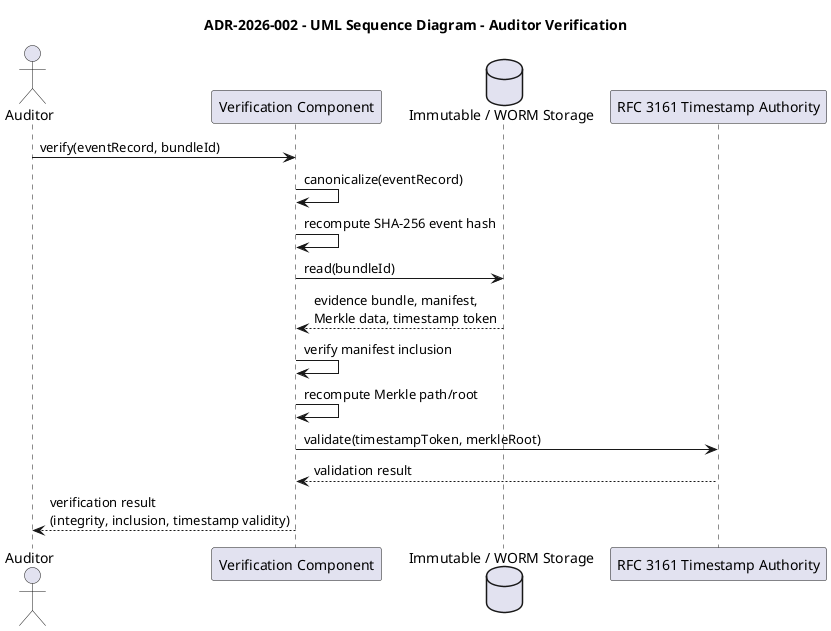
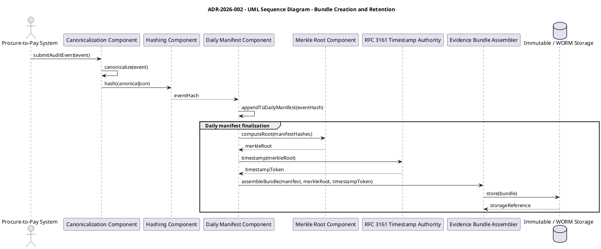
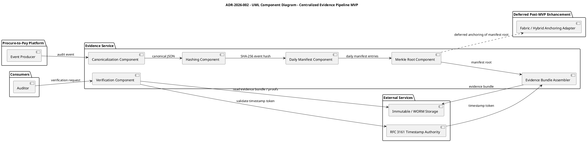
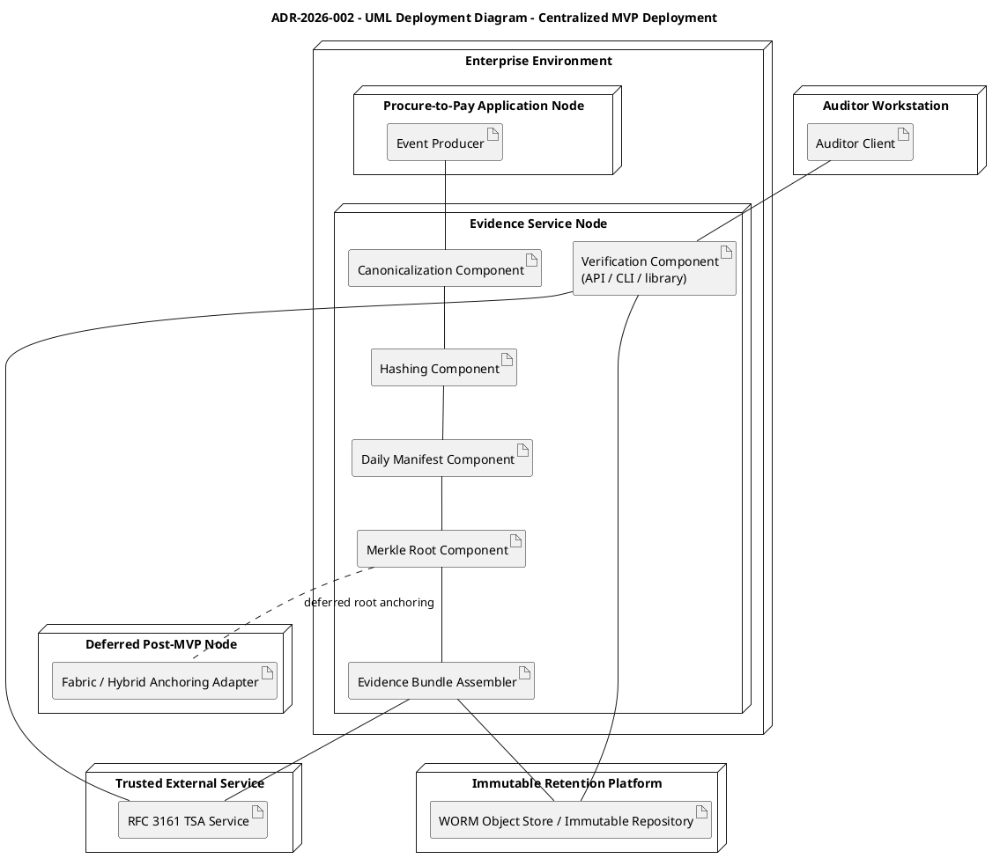
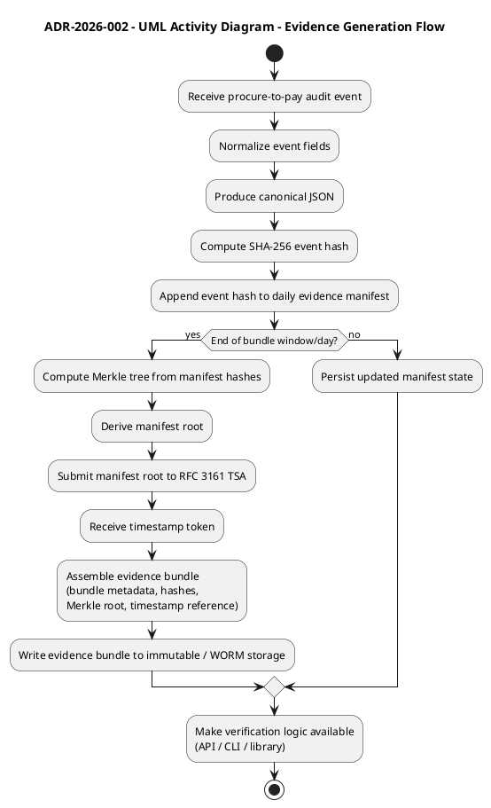

# Here more diagrams in the form of plantuml text to add more context
[comment]: <> (this diagram are taken from .\\feature\\PBI-002-audit-trail-spike\\adrs\\diagrams\\)

`auditor-verification.puml`

`bundle-creation-and-retention.puml`

`centralized-evidence-pipeline-mvp.puml`

`centralized-mvp-deployment.puml`

`evidence-generator-flow.puml`

