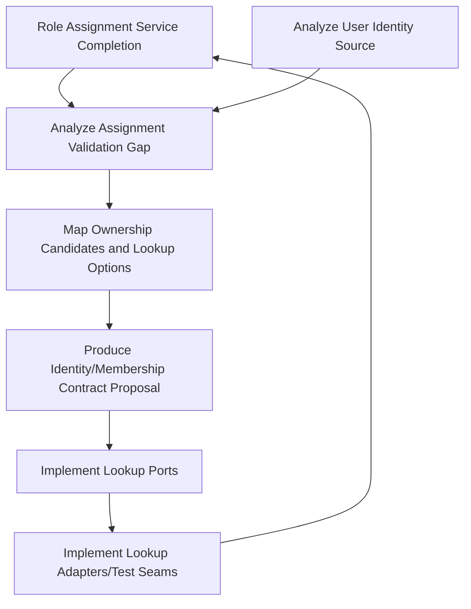

# PBI-098: Role Assignment Validation Gap Analysis

Status: Analysis artifact  
Owner: Engineering / Architecture  
Last updated: 2026-03-25

## 1. Current implemented behavior

The current `createRoleAssignment` function in `src/modules/access-control/application/create-role-assignment.ts` implements these validations:

1. **Role existence validation**
   - Checks if the provided `roleId` exists in the role repository
   - Returns `roleNotFound` result if role does not exist

2. **Organization existence validation**
   - Checks if the provided `organizationId` exists in the member organization repository
   - Returns `organizationNotFound` result if organization does not exist

3. **Duplicate active assignment validation**
   - Checks if an active assignment already exists for the same `userId`/`organizationId`/`roleId` combination
   - Uses `findActiveByUserOrganizationRole` repository method
   - Returns `duplicate` result if active assignment already exists

4. **Successful assignment creation**
   - If all above validations pass, saves the assignment and returns `created` result

Note: The API route in `src/modules/access-control/api/routes.ts` currently does not enforce any authorization for role assignment creation, but this is a separate concern from validation logic.

## 2. Remaining blocked behaviors

The following acceptance-criteria paths remain impossible to implement with current system capabilities:

1. **Invalid user validation**
   - Cannot validate that the provided `userId` represents a real existing user
   - No repository or service exists to check user existence
   - Would require `VALIDATION_ERROR` response with message "Invalid userId: User does not exist"

2. **Non-member validation**
   - Cannot validate that the user belongs to the specified organization
   - No mechanism to check user-to-organization membership
   - Would require `VALIDATION_ERROR` response with message "Invalid userId: User is not a member of the specified organization"

3. **Corresponding error-path implications**
   - Missing these validations creates a gap where assignments can be created for non-existent users
   - Assignments could potentially be created for users not belonging to the target organization
   - Error responses for these cases are not defined in the current implementation

## 3. Unresolved flags and prerequisite decisions

The following flags and assumptions block completion of role assignment validation:

1. **`FLAG-USER-IDENTITY`**
   - No source of truth for user lifecycle or identity validation
   - User provisioning model not yet defined
   - Cannot implement user validation without knowing where to check user existence

2. **`FLAG-ASSIGNMENT-MULTIPLICITY`**
   - User-to-organization membership validation approach not defined
   - Cannot implement membership validation without knowing the membership model

3. **Prerequisite decisions required**
   - Need explicit decision on user identity source of truth (PBI-084)
   - Need explicit decision on membership lookup mechanism
   - No placeholder logic is acceptable because:
     - Placeholder logic would create technical debt
     - Would require rework once real implementation is available
     - Could establish incorrect contract expectations
     - Might mask real integration complexities

## 4. Dependency map

## 5. Acceptance-criteria coverage note

**Already covered:**
- Role existence validation
- Organization existence validation
- Duplicate active assignment prevention

**Partially covered:**
- None - the core validation gaps are completely unaddressed

**Blocked:**
- User existence validation
- User-to-organization membership validation
- Corresponding error responses for invalid users and non-members

## 6. Handoff to next PBIs

**PBI-099 must decide:**
- What are the ownership candidates for user identity management?
- What are the possible lookup boundary options for user existence?
- What are the ownership candidates for membership management?
- What are the possible lookup boundary options for membership validation?

**PBI-100 must propose:**
- Approved identity lookup contract proposal
- Approved membership lookup contract proposal
- Clear boundaries for these lookup services
- Repository interfaces for user and membership lookups

**Must not be implemented before those decisions:**
- No user existence validation logic
- No user-to-organization membership validation logic
- No placeholder/fake validation implementations
- No assumptions about user identity sources or membership models
