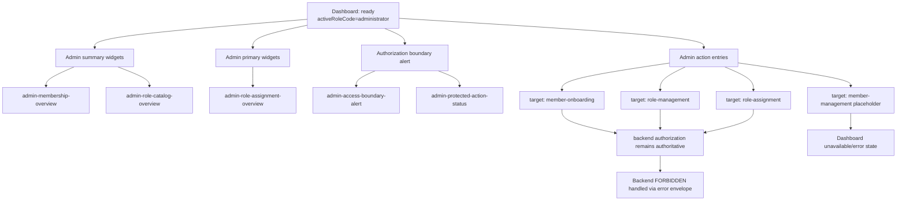

# Administrator Dashboard Widget Contract

Status: Accepted for PBI-177 implementation  
Accepted: PBI-176 accepted by Scrum Master / Product Owner on 2026-05-23  
Owner: Frontend + Architecture  
Related feature: PBI-017 — Role-based UI and operational dashboards  
Related story: PBI-147 — Administrator dashboard widgets  
Related completed task: PBI-176 — Define administrator widget contract and membership or access-control action entry mapping  
Related implementation task: PBI-177 — Implement administrator dashboard widgets for member onboarding, roles, and assignments  
Related hardening task: PBI-178 — Add administrator widget permission filtering and summary-state hardening  
Related validation task: PBI-179 — Execute administrator widget validation, documentation updates, and evidence closure  
Related requirement: R17 — Role-based UI and dashboards  
Related decision record: `docs/architecture/adr/ADR-001-dashboard-auth-boundary-and-state-flow.md`

## 1. Purpose

This document defines the administrator dashboard widget contract and action-entry mapping that must be consumed by PBI-177 and PBI-178.

The purpose is to prevent administrator widgets from inventing ad hoc fields, route targets, action semantics, or authorization assumptions.

## 2. Scope

### In scope

- Administrator-facing widget IDs and zones.
- Widget summary-state semantics.
- Action entry-point mapping to existing frontend targets.
- Visibility and blocked-state rules.
- Relationship to backend membership, role, and role-assignment contracts.
- Placeholder/unavailable handling for actions that do not yet have stable backend/frontend support.

### Out of scope

- Real authentication or session issuance.
- Public account creation or self-registration.
- New backend APIs.
- Backend authorization changes.
- New role catalog rules.
- KYC/AML workflow widgets.
- Shariah reviewer widgets.
- Auditor/security widgets.
- High-fidelity visual design.

## 3. ADR-001 boundary

ADR-001 controls this widget contract.

Rules that apply:

- PBI-017 starts from resolved actor context; it does not implement login or account creation.
- Dashboard role labels do not grant backend privileges.
- Backend authorization remains authoritative for protected actions.
- Frontend forbidden states are UX guards only.
- `pendingReview` organizations require limited/status behavior, not full operational dashboards.
- `inactive`, `suspended`, and `deleted` organizations must not receive protected-write affordances.
- Widget areas must be classified as contract-backed, contract-pending, or placeholder before implementation.

## 4. Administrator widget readiness classification

| Widget area | Classification | Reason |
|---|---|---|
| Member onboarding entry | contract-backed | Membership create/status contracts and frontend page exist. |
| Member status summary | contract-backed for known state vocabulary; data availability depends on list/read capability | Organization status values are defined, but summary counts must not be fabricated if no list/summary API exists. |
| Role catalog entry | contract-backed | Role create/update/list contracts exist. |
| Role status summary | contract-backed for role state vocabulary; data availability depends on list/read response | Role states are defined as `active` and `inactive`. |
| Role assignment entry | contract-backed | Role assignment and revoke contracts exist. |
| Role assignment summary | contract-backed for assignment state vocabulary; data availability depends on list/read capability | Assignment states are `active` and `revoked`. |
| Access-boundary notice | contract-backed | Backend authorization boundary and error envelope are defined. |
| Member management shortcut | placeholder/unavailable | Registered dashboard target exists as placeholder; no completed page contract is assumed here. |

## 5. Administrator dashboard widget model

Administrator widgets extend the base `DashboardWidget` contract with administrator-specific display and action semantics.

```typescript
interface AdministratorDashboardWidget {
  id: string;
  title: string;
  zoneId: 'summary' | 'primary' | 'secondary' | 'actions' | 'alerts';
  allowedRoles: ['administrator'];
  status: 'placeholder' | 'loading' | 'active' | 'unavailable' | 'error';
  summaryState?: AdminWidgetSummaryState;
  actionEntries: AdminWidgetActionEntry[];
  dataExpectation: 'contractBacked' | 'contractBackedNoSummaryApi' | 'placeholder';
  emptyState: {
    title: string;
    message: string;
  };
  errorState: {
    title: string;
    message: string;
  };
  downstreamPbi: 'PBI-177' | 'PBI-178' | 'PBI-179';
}
```

### 5.1 Summary state model

```typescript
type AdminWidgetSummaryState =
  | 'ready'
  | 'empty'
  | 'partial'
  | 'unavailable'
  | 'forbidden'
  | 'error';
```

| State | Meaning | UI behavior |
|---|---|---|
| `ready` | Contract-backed data is available and safe to display. | Show summary values and allowed actions. |
| `empty` | Query/list succeeded but no records exist. | Show empty-state message, not an error. |
| `partial` | Some data is available but not enough for a complete summary. | Show available data and a clear partial-data note. |
| `unavailable` | Required backend read/list capability is not available yet. | Show disabled or placeholder summary; do not invent counts. |
| `forbidden` | Backend returned `FORBIDDEN` or actor lacks required backend authorization. | Show safe forbidden message using standard error-envelope semantics. |
| `error` | Backend or frontend failure unrelated to normal empty/forbidden states. | Show safe error state, no sensitive details. |

## 6. Administrator widgets

### 6.1 `admin-membership-overview`

| Field | Value |
|---|---|
| Zone | `summary` |
| Purpose | Show high-level member organization state. |
| Allowed role | `administrator` |
| Data expectation | `contractBackedNoSummaryApi` |
| Supported states | `ready`, `empty`, `partial`, `unavailable`, `forbidden`, `error` |
| Downstream implementation | PBI-177 |

Permitted status vocabulary:

- `pendingReview`
- `active`
- `inactive`
- `suspended`
- `deleted`

Display rule:

- If reliable member counts are unavailable, render summary as `unavailable` with a clear message.
- Do not fabricate counts.
- Do not imply `pendingReview` organizations can perform protected operational actions.

Action entries:

- `open-member-onboarding`
- `open-member-management-placeholder`

### 6.2 `admin-role-catalog-overview`

| Field | Value |
|---|---|
| Zone | `summary` or `primary` |
| Purpose | Surface role catalog status and route to role management. |
| Allowed role | `administrator` |
| Data expectation | `contractBacked` |
| Supported states | `ready`, `empty`, `partial`, `unavailable`, `forbidden`, `error` |
| Downstream implementation | PBI-177 |

Permitted role status vocabulary:

- `active`
- `inactive`

Display rule:

- Inactive roles must be visibly non-assignable.
- Role catalog write affordances must be hidden or blocked if backend authorization returns `FORBIDDEN`.

Action entries:

- `open-role-management`

### 6.3 `admin-role-assignment-overview`

| Field | Value |
|---|---|
| Zone | `primary` or `actions` |
| Purpose | Surface role-assignment operational entry points. |
| Allowed role | `administrator` |
| Data expectation | `contractBackedNoSummaryApi` |
| Supported states | `ready`, `empty`, `partial`, `unavailable`, `forbidden`, `error` |
| Downstream implementation | PBI-177 |

Permitted assignment status vocabulary:

- `active`
- `revoked`

Display rule:

- Only active assignments should be treated as operational.
- Revoked assignments remain historical and must not grant dashboard access.
- Assignment controls must respect active user, active role, and non-deleted organization requirements.

Action entries:

- `open-role-assignment`

### 6.4 `admin-access-boundary-alert`

| Field | Value |
|---|---|
| Zone | `alerts` |
| Purpose | Warn that frontend administrator shell visibility is not backend admin authorization. |
| Allowed role | `administrator` |
| Data expectation | `contractBacked` |
| Supported states | `ready` |
| Downstream implementation | PBI-177/PBI-178 |

Required message meaning:

```text
Dashboard administrator visibility is a frontend shell context. Backend authorization remains authoritative for protected actions.
```

### 6.5 `admin-protected-action-status`

| Field | Value |
|---|---|
| Zone | `secondary` or `alerts` |
| Purpose | Surface recent protected-action blocked/forbidden state in a safe way where data is available. |
| Allowed role | `administrator` |
| Data expectation | `contractBackedNoSummaryApi` until access-history consumption is approved for this widget |
| Supported states | `unavailable`, `forbidden`, `error`, `partial` |
| Downstream implementation | PBI-178 |

Display rule:

- Do not consume audit/access-history payloads unless the consuming task explicitly owns that contract.
- If no approved source exists, show `unavailable`, not fabricated blocked-action counts.

## 7. Administrator action-entry contract

```typescript
interface AdminWidgetActionEntry {
  id: string;
  label: string;
  target: string;
  zoneId: 'summary' | 'primary' | 'secondary' | 'actions' | 'alerts';
  allowedRoles: ['administrator'];
  requiredPermissions?: string[];
  availability: 'available' | 'placeholder' | 'blocked';
  navigationBehavior: 'navigate' | 'showUnavailable' | 'showForbidden';
  backendAuthorization: 'requiredForProtectedAction' | 'notApplicableForNavigationOnly';
  blockedStateMessage: string;
}
```

## 8. Approved administrator action entries

| Action ID | Label | Target | Availability | Navigation behavior | Backend authorization note |
|---|---|---|---|---|---|
| `open-member-onboarding` | Member Onboarding | `member-onboarding` | `available` | `navigate` | Navigation only; protected writes inside page require backend authorization. |
| `open-role-management` | Role Management | `role-management` | `available` | `navigate` | Role create/update operations require backend admin authorization. |
| `open-role-assignment` | Role Assignment | `role-assignment` | `available` | `navigate` | Assignment/revoke operations require backend admin authorization. |
| `open-member-management-placeholder` | Member Management | `member-management` | `placeholder` | `showUnavailable` | No completed page contract; do not silently route to dashboard. |

## 9. Visibility and blocked-action rules

### 9.1 Normal navigation and widget display

- Administrator widgets are visible only when the active dashboard role is `administrator`.
- Administrator widgets must not be merged into other role dashboards because of multi-role priority.
- Disallowed administrator actions should be hidden from normal navigation for non-administrator roles.
- Placeholder actions may be shown only if clearly disabled or if they route to the approved unavailable state.

### 9.2 Direct access

- Direct access to known administrator targets from a non-administrator role must render the dashboard `forbidden` shell state.
- Direct access to administrator placeholder targets must render an unavailable/error state, not a fake page.
- Direct access behavior is a UX guard only.

### 9.3 Backend-protected actions

- Frontend action entries may navigate to governed pages.
- Backend protected writes remain authoritative.
- If the backend returns `FORBIDDEN`, the widget or page must display a safe error-envelope-derived message.
- The frontend must not inject `x-actor-role`, `x-actor-id`, or any client-authored actor identity as a source of authorization.

## 10. Organization and user-state gates

ADR-001 requires future dashboard actor-context gates.

Until that gate exists, administrator widgets must remain careful not to imply full production authorization.

Future implementation must handle:

| Context state | Required behavior |
|---|---|
| inactive user | block before dashboard role resolution |
| no active role assignment | `noRole` |
| unsupported role code | `unsupportedRole` |
| `pendingReview` organization | limited/status dashboard; no protected-write affordances |
| `inactive` organization | blocked/status-only for operational actions |
| `suspended` organization | blocked/status-only for operational actions |
| `deleted` organization | blocked/status-only for operational actions |
| active organization | operational dashboard if role mapping and backend authorization pass |

## 11. Widget placement map

| Widget ID | Zone | Primary actions | Empty/unavailable behavior |
|---|---|---|---|
| `admin-membership-overview` | `summary` | `open-member-onboarding`, `open-member-management-placeholder` | Show unavailable if counts/source are not available. |
| `admin-role-catalog-overview` | `summary` or `primary` | `open-role-management` | Show empty state if no roles are returned; show forbidden if backend denies. |
| `admin-role-assignment-overview` | `primary` or `actions` | `open-role-assignment` | Show unavailable if assignment summary source is absent. |
| `admin-access-boundary-alert` | `alerts` | none | Always show boundary message where administrator shell is active. |
| `admin-protected-action-status` | `secondary` or `alerts` | none | Show unavailable unless an approved event/access source is consumed. |

## 12. State-flow sketch



## 13. Acceptance guidance for PBI-177 and PBI-178

PBI-177 implementation should:

- create administrator widgets using the IDs and zones in this contract;
- route action entries to approved targets only;
- preserve placeholder/unavailable behavior for `member-management`;
- not implement KYC/AML, Shariah, auditor/security, buyer, supplier, or financier widgets;
- not redefine backend authorization.

PBI-178 hardening should:

- ensure non-administrator dashboards do not expose administrator widgets;
- ensure direct access to administrator targets from other roles returns the approved forbidden state;
- ensure unavailable summary data is not displayed as real metrics;
- ensure backend `FORBIDDEN` remains the authoritative protected-action result.

## 14. ADR need

No new ADR is required for this contract.

This document does not change the dashboard auth boundary, role vocabulary, API response envelope, or widget-zone model. It specializes administrator widget semantics within the already-approved dashboard shell contract and ADR-001 boundary.
