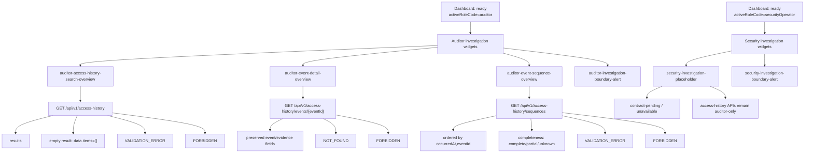

# Auditor and Security Dashboard Investigation Widget Contract

Status: Draft contract for PBI-188 review  
Owner: Frontend + Architecture + Audit/Security  
Related feature: PBI-017 — Role-based UI and operational dashboards  
Related story: PBI-151 — Auditor/security access-history investigation dashboard widgets  
Related task: PBI-188 — Define auditor or security dashboard investigation widget contract and access-history consumption mapping  
Related implementation task: PBI-189 — Implement dashboard investigation widgets consuming access-history search and event-detail capabilities  
Related hardening task: PBI-190 — Add empty-result, validation, and forbidden-state handling for dashboard investigation widgets  
Related validation task: PBI-191 — Execute dashboard investigation widget validation, documentation updates, and evidence closure  
Related requirements: R17, R22  
Related backend capabilities: PBI-121, PBI-122  
Related decision record: `docs/architecture/adr/ADR-001-dashboard-auth-boundary-and-state-flow.md`

## 1. Purpose

This document defines the auditor/security dashboard investigation widget contract and access-history API consumption mapping for PBI-151.

The goal is to let PBI-189 and PBI-190 implement dashboard investigation widgets without redefining completed PBI-121/PBI-122 access-history payloads, filters, ordering, event-detail fields, sequence semantics, or backend authorization behavior.

## 2. Scope

### In scope

- Auditor/security investigation widget IDs and zones.
- Access-history search, event-detail, and sequence entry-point mapping.
- Role visibility rules for `auditor` and `securityOperator`.
- Backend API consumption mapping for completed access-history APIs.
- Empty, validation, forbidden, unavailable, and incomplete-sequence state rules.
- Summary-state honesty rules for investigation widgets.
- ADR-001 dashboard/auth-boundary alignment.
- Implementation guidance for PBI-189, PBI-190, and PBI-191.

### Out of scope

- New audit APIs.
- Redefining access-history event payloads.
- Redefining access-history query filters.
- Redefining event-detail or sequence response shapes.
- External SIEM/export integrations.
- Analytics dashboards.
- Administrator widgets.
- Compliance/review widgets.
- Buyer, supplier, financier, or Shariah workflow widgets.
- Backend authorization changes.
- Real authentication, session issuance, logout, or account creation.
- High-fidelity UI redesign.

## 3. Source contracts consumed

PBI-151 must consume completed access-history contracts rather than redefine them.

Primary contracts:

- `docs/contracts/API_CONTRACTS.md` section 10 — Access history contracts.
- `docs/contracts/ACCESS_HISTORY_QUERY_CONTRACT.md` — PBI-121 access-history search/query contract.
- `docs/contracts/ACCESS_AUDIT_EVENT_INSPECTION_CONTRACT.md` — PBI-122 event-detail and sequence-inspection contract.

Relevant API endpoints:

| Capability | Endpoint | Contract source |
|---|---|---|
| Access-history search | `GET /api/v1/access-history` | API_CONTRACTS.md section 10.1 / ACCESS_HISTORY_QUERY_CONTRACT.md |
| Access event detail | `GET /api/v1/access-history/events/{eventId}` | API_CONTRACTS.md section 10.2 / ACCESS_AUDIT_EVENT_INSPECTION_CONTRACT.md |
| Access event sequence | `GET /api/v1/access-history/sequences` | API_CONTRACTS.md section 10.3 / ACCESS_AUDIT_EVENT_INSPECTION_CONTRACT.md |

## 4. Backend authorization boundary

The current access-history API contract says access-history search, event detail, and event sequence require the `auditor` role. Non-auditor requests receive `403 FORBIDDEN`.

PBI-151 includes both `auditor` and `securityOperator` as dashboard actors. This contract resolves that tension as follows:

- `auditor` widgets may expose active access-history API entry points.
- `securityOperator` widgets may be visible as investigation affordances, but must not imply backend access-history authorization unless backend contracts explicitly permit it.
- Security-operator access-history actions remain `contractPending` or `forbidden` from the dashboard perspective until the backend authorization contract includes `securityOperator` or a security-specific investigation endpoint.
- Frontend role visibility must never override backend `FORBIDDEN` responses.
- PBI-189 must not locally broaden access-history API authorization by changing frontend labels or dashboard target rules.

## 5. ADR-001 boundary

ADR-001 controls this dashboard story.

Rules that apply:

- PBI-017 starts from resolved actor context; it does not implement login or account creation.
- Dashboard role labels do not grant backend privileges.
- Backend authorization remains authoritative for protected and sensitive-read actions.
- Frontend forbidden states are UX guards only.
- Widgets must be classified as contract-backed, contract-pending, or placeholder before implementation.
- PBI-017 must not add client-authored actor identity as an authorization source.

## 6. Role coverage

### 6.1 `auditor`

Purpose:

- Search access-history events.
- Inspect individual audit event evidence.
- Inspect actor or target chronological sequences.
- Review incomplete/unknown sequence completeness without overstating audit certainty.

Current contract posture:

- Access-history search/detail/sequence capabilities are contract-backed for `auditor`.
- Widget actions may route to dashboard flows that consume completed APIs.
- Backend authorization remains authoritative.

### 6.2 `securityOperator`

Purpose:

- Surface security investigation entry points and negative/forbidden-state behavior in the dashboard.
- Avoid implying the security operator can use auditor-only APIs unless backend contracts permit it.

Current contract posture:

- Access-history API consumption is contract-pending for `securityOperator` because the current backend access-history API requires `auditor`.
- Security widgets may render a security investigation placeholder or blocked-state affordance.
- Direct access to auditor-only access-history targets as `securityOperator` must resolve `forbidden` unless a later backend contract expands allowed roles.

## 7. Widget readiness classification

| Widget area | Role | Classification | Reason |
|---|---|---|---|
| Access-history search | `auditor` | contract-backed | PBI-121 / API_CONTRACTS.md section 10.1 define search behavior. |
| Access event detail | `auditor` | contract-backed | PBI-122 / API_CONTRACTS.md section 10.2 define event-detail behavior. |
| Access event sequence | `auditor` | contract-backed | PBI-122 / API_CONTRACTS.md section 10.3 define sequence behavior and completeness metadata. |
| Investigation boundary alert | `auditor` | contract-backed | Backend authorization and audit payload semantics are defined. |
| Security investigation entry | `securityOperator` | contract-pending / placeholder | Current backend access-history API requires `auditor`; no security-specific audit API is approved here. |
| Security forbidden-state alert | `securityOperator` | contract-backed | It is safe to display a boundary/blocked-state warning without granting access. |

## 8. Investigation widget model

Investigation widgets extend the base `DashboardWidget` contract with access-history consumption semantics.

```typescript
interface InvestigationDashboardWidget {
  id: string;
  title: string;
  zoneId: 'summary' | 'primary' | 'secondary' | 'actions' | 'alerts' | 'investigation';
  allowedRoles: Array<'auditor' | 'securityOperator'>;
  status: 'placeholder' | 'loading' | 'active' | 'unavailable' | 'error';
  dataExpectation: 'contractBacked' | 'contractPending' | 'placeholder';
  actionEntries: InvestigationWidgetActionEntry[];
  apiConsumption?: AccessHistoryApiConsumption;
  emptyState: {
    title: string;
    message: string;
  };
  errorState: {
    title: string;
    message: string;
  };
  downstreamPbi: 'PBI-189' | 'PBI-190' | 'PBI-191';
}
```

### 8.1 API consumption descriptor

```typescript
interface AccessHistoryApiConsumption {
  capability: 'search' | 'eventDetail' | 'sequence';
  endpoint: '/api/v1/access-history' | '/api/v1/access-history/events/{eventId}' | '/api/v1/access-history/sequences';
  method: 'GET';
  preservesPayloadSemantics: true;
  backendAuthorization: 'auditorRequired';
}
```

### 8.2 Action-entry model

```typescript
interface InvestigationWidgetActionEntry {
  id: string;
  label: string;
  target: string;
  zoneId: 'summary' | 'primary' | 'secondary' | 'actions' | 'alerts' | 'investigation';
  allowedRoles: Array<'auditor' | 'securityOperator'>;
  availability: 'available' | 'placeholder' | 'contractPending' | 'blocked';
  navigationBehavior: 'navigate' | 'showUnavailable' | 'showContractPending' | 'showForbidden' | 'showValidationError' | 'showEmptyResult';
  backendAuthorization: 'auditorRequired' | 'notApplicableForNavigationOnly';
  blockedStateMessage: string;
}
```

## 9. Auditor widgets

### 9.1 `auditor-access-history-search-overview`

| Field | Value |
|---|---|
| Zone | `primary` or `investigation` |
| Purpose | Route to access-history search flow. |
| Allowed role | `auditor` |
| Data expectation | `contractBacked` |
| API capability | `GET /api/v1/access-history` |
| Supported states | `ready`, `empty`, `validationError`, `forbidden`, `error` |
| Downstream implementation | PBI-189 |

Contract-backed filters:

- `actorUserId`
- `targetType`
- `targetId`
- `action`
- `outcome`
- `occurredFrom`
- `occurredTo`
- `module`
- `route`
- `method`

Display rules:

- Empty result is success with `data.items = []`.
- Results are ordered by `occurredAt` ascending, then `eventId` ascending.
- Unknown query parameters and invalid filter values must surface validation feedback; the widget must not reinterpret validation errors as empty results.
- The widget must preserve source event field names and semantics.

Action entries:

- `open-access-history-search`

### 9.2 `auditor-event-detail-overview`

| Field | Value |
|---|---|
| Zone | `primary` or `secondary` |
| Purpose | Route to event-detail inspection by `eventId`. |
| Allowed role | `auditor` |
| Data expectation | `contractBacked` |
| API capability | `GET /api/v1/access-history/events/{eventId}` |
| Supported states | `ready`, `notFound`, `forbidden`, `validationError`, `error` |
| Downstream implementation | PBI-189 |

Required preserved fields:

- `eventId`
- `schemaVersion`
- `occurredAt`
- `requestId`
- `actorUserId`
- `actorSource`
- `action`
- `targetType`
- `targetId`
- `outcome`
- `reason` where present
- `module`
- `route` where present
- `method` where present
- `evidence.payloadHash`
- `evidence.canonicalization`
- `evidence.previousEventHash` where present

Display rules:

- Missing event is `NOT_FOUND`, not empty result.
- No fabricated event payload may be shown.
- Evidence fields must be displayed or passed through without renaming semantics.

Action entries:

- `open-access-event-detail`

### 9.3 `auditor-event-sequence-overview`

| Field | Value |
|---|---|
| Zone | `investigation` or `secondary` |
| Purpose | Route to actor/target chronological sequence inspection. |
| Allowed role | `auditor` |
| Data expectation | `contractBacked` |
| API capability | `GET /api/v1/access-history/sequences` |
| Supported states | `ready`, `empty`, `validationError`, `forbidden`, `incomplete`, `error` |
| Downstream implementation | PBI-189/PBI-190 |

Supported sequence modes:

- `scope=actor` with `actorUserId`
- `scope=target` with `targetType` and `targetId`

Display rules:

- Actor and target sequence modes must not be mixed.
- Ordering is `occurredAt` ascending, then `eventId` ascending.
- Completeness metadata must be shown when present.
- MVP completeness may be `unknown` with `reason=\"completeness_not_proven\"`.
- Unknown completeness must not be presented as complete lifecycle evidence.

Action entries:

- `open-access-event-sequence`

### 9.4 `auditor-investigation-boundary-alert`

| Field | Value |
|---|---|
| Zone | `alerts` |
| Purpose | Warn that frontend investigation widgets do not redefine backend audit semantics or authorization. |
| Allowed role | `auditor` |
| Data expectation | `contractBacked` |
| Supported states | `ready` |
| Downstream implementation | PBI-189/PBI-190 |

Required message meaning:

```text
Investigation dashboard visibility is not backend authorization. Access-history payloads, evidence fields, ordering, and completeness semantics remain governed by the backend access-history contracts.
```

## 10. Security operator widgets

### 10.1 `security-investigation-placeholder`

| Field | Value |
|---|---|
| Zone | `primary` or `investigation` |
| Purpose | Surface security investigation area without granting auditor-only access-history API rights. |
| Allowed role | `securityOperator` |
| Data expectation | `contractPending` |
| API capability | none until backend contract expands |
| Supported states | `contractPending`, `forbidden`, `unavailable` |
| Downstream implementation | PBI-189/PBI-190 |

Display rules:

- Must state that access-history APIs currently require `auditor` backend authorization.
- Must not show fake search results, event details, sequences, or audit metrics.
- Must not call auditor-only APIs as if securityOperator access is approved.
- If a later backend contract permits securityOperator access, update this contract before changing implementation.

Action entries:

- `open-security-investigation-placeholder`

### 10.2 `security-investigation-boundary-alert`

| Field | Value |
|---|---|
| Zone | `alerts` |
| Purpose | Explain security dashboard access boundary. |
| Allowed role | `securityOperator` |
| Data expectation | `contractBacked` |
| Supported states | `ready` |
| Downstream implementation | PBI-189/PBI-190 |

Required message meaning:

```text
Security dashboard visibility does not grant access-history API permission. Auditor-only backend contracts remain authoritative until an approved security investigation contract exists.
```

## 11. Governed action mapping

| Action ID | Source widget | Target | Allowed role | Availability | Navigation behavior | Backend API mapping |
|---|---|---|---|---|---|---|
| `open-access-history-search` | `auditor-access-history-search-overview` | `access-history-search` | `auditor` | `available` | `navigate` | `GET /api/v1/access-history` |
| `open-access-event-detail` | `auditor-event-detail-overview` | `access-event-detail` | `auditor` | `available` | `navigate` | `GET /api/v1/access-history/events/{eventId}` |
| `open-access-event-sequence` | `auditor-event-sequence-overview` | `access-event-sequence` | `auditor` | `available` | `navigate` | `GET /api/v1/access-history/sequences` |
| `open-security-investigation-placeholder` | `security-investigation-placeholder` | `security-investigation` | `securityOperator` | `contractPending` | `showContractPending` or `showForbidden` | none |

## 12. Dashboard target registry rules

PBI-189 should register dashboard targets as follows unless the backend authorization contract changes first:

| Target | Allowed role | Availability | Expected resolver behavior |
|---|---|---|---|
| `access-history-search` | `auditor` | `available` | `auditor -> allowed`; non-auditor -> `forbidden` |
| `access-event-detail` | `auditor` | `available` | `auditor -> allowed`; non-auditor -> `forbidden` |
| `access-event-sequence` | `auditor` | `available` | `auditor -> allowed`; non-auditor -> `forbidden` |
| `security-investigation` | `securityOperator` | `placeholder` | `securityOperator -> unavailable`; non-security role -> `forbidden` |

Rules:

- Do not add `securityOperator` to auditor-only access-history targets unless `API_CONTRACTS.md` or a contract doc is updated first.
- Do not silently reuse old generic placeholder targets (`access-history`, `investigations`, `monitoring`, `incidents`) as if they are the approved investigation contract.
- If aliases are kept for backwards compatibility, document them and resolve them to the approved targets above.

## 13. Role visibility rules

### 13.1 Normal rendering

- `auditor` widgets render only when active dashboard role is `auditor`.
- `securityOperator` widgets render only when active dashboard role is `securityOperator`.
- Shared widgets must explicitly list both roles in `allowedRoles`, and only if both roles are contract-approved.
- Widgets must still pass the dashboard shell render-time filter.
- Widgets must not be merged across roles because of multi-role priority.

### 13.2 Direct access rules

- Direct access to auditor-only access-history targets by `securityOperator` must resolve `forbidden` unless backend contracts are updated.
- Direct access to auditor-only access-history targets by administrator, complianceReviewer, shariahReviewer, buyer, supplier, or financier must resolve `forbidden`.
- Direct access to `security-investigation` by `securityOperator` should resolve `unavailable` while it is a placeholder.
- Direct access to unknown investigation targets should resolve `unknown`.

## 14. Access-history response-state rules

### 14.1 Search flow

| Backend or query outcome | Widget/page state |
|---|---|
| `200` with `data.items.length > 0` | Show ordered results. |
| `200` with `data.items = []` | Show empty-result state, not error. |
| `400 VALIDATION_ERROR` | Show validation feedback. |
| `403 FORBIDDEN` | Show forbidden/blocked state. |
| Unexpected failure | Show safe error state. |

### 14.2 Event-detail flow

| Backend or query outcome | Widget/page state |
|---|---|
| `200` with `data.event` | Show preserved event detail fields and evidence fields. |
| `404 NOT_FOUND` | Show not-found state, not empty result. |
| `403 FORBIDDEN` | Show forbidden/blocked state. |
| `400 VALIDATION_ERROR` | Show validation feedback if eventId format/route input is invalid. |
| Unexpected failure | Show safe error state. |

### 14.3 Sequence flow

| Backend or query outcome | Widget/page state |
|---|---|
| `200` with items and completeness metadata | Show ordered sequence and completeness status. |
| `200` with `data.items = []` | Show empty sequence state, not error. |
| Completeness `unknown` or `partial` | Show incomplete/unknown warning; do not imply complete evidence. |
| `400 VALIDATION_ERROR` | Show validation feedback. |
| `403 FORBIDDEN` | Show forbidden/blocked state. |
| Unexpected failure | Show safe error state. |

## 15. Summary-state honesty rules

- Do not fabricate access-event counts.
- Do not fabricate incident counts.
- Do not fabricate security alert counts.
- Do not claim sequence completeness unless backend completeness metadata proves it.
- Missing data source means unavailable/contract-pending, not zero.
- Empty successful backend results mean empty, not error.
- Widget labels must not imply analytics dashboards are implemented.

## 16. Payload preservation rules

PBI-189/PBI-190 must preserve backend audit semantics:

- Do not rename or reinterpret `eventId`, `schemaVersion`, `occurredAt`, `requestId`, `actorUserId`, `actorSource`, `action`, `targetType`, `targetId`, `outcome`, `reason`, `module`, `route`, `method`, or `evidence` fields.
- Do not synthesize `payloadHash`, `canonicalization`, or `previousEventHash` values.
- Do not infer sequence completeness beyond backend metadata.
- Do not collapse validation, forbidden, not-found, and empty-result states into one generic error state.
- Do not add frontend-only actor identity or role headers as an authorization source.

## 17. State-flow sketch



## 18. Implementation guidance for PBI-189

PBI-189 should:

- implement widgets using the IDs in this contract;
- register the approved dashboard targets;
- route all widget actions through the central dashboard page-change handler;
- preserve `resolveDashboardTargetAccess(...)` as the central access resolver;
- consume existing access-history API shapes without changing backend payload semantics;
- implement auditor widgets as active entry points;
- implement securityOperator widgets as contract-pending/placeholder unless backend authorization changes first;
- avoid fake event counts or analytics cards;
- avoid new audit APIs;
- avoid backend changes;
- avoid frontend-auth/session changes.

Recommended initial widget set for PBI-189:

- `auditor-access-history-search-overview`;
- `auditor-event-detail-overview`;
- `auditor-event-sequence-overview`;
- `auditor-investigation-boundary-alert`;
- `security-investigation-placeholder`;
- `security-investigation-boundary-alert`.

## 19. Hardening guidance for PBI-190

PBI-190 should validate and harden:

- role-only visibility for `auditor` widgets;
- role-only visibility for `securityOperator` widgets;
- mixed-widget-array defensive filtering;
- direct access to auditor-only targets by `securityOperator` resolves forbidden;
- empty search result handling;
- invalid query validation feedback;
- event-detail not-found behavior;
- sequence completeness unknown/partial warnings;
- backend `FORBIDDEN` handling;
- payload preservation.

## 20. Validation guidance for PBI-191

PBI-191 evidence should include:

- implemented auditor/security widget IDs;
- role visibility matrix;
- action-entry mapping table;
- access-history search consumption evidence;
- event-detail consumption evidence;
- sequence/completeness consumption evidence;
- empty-result evidence;
- validation-error evidence;
- forbidden-state evidence;
- backend payload preservation evidence;
- validation command results;
- known limitations and follow-up recommendations.

## 21. Contract conflict note

There is an intentional scope boundary to resolve before implementation expands security-operator access:

- PBI-151 names `auditor or security operator` as dashboard actors.
- The current access-history backend contracts require `auditor` for search, event detail, and sequence retrieval.

Therefore PBI-188 approves securityOperator visibility only as contract-pending/placeholder until backend access-history authorization is expanded by an explicit contract update. This avoids silently changing PBI-022/PBI-121/PBI-122 semantics from the frontend branch.

## 22. ADR need

No new ADR is required for this contract.

This document does not change:

- dashboard auth boundary;
- API response semantics;
- access-history payload semantics;
- role vocabulary;
- widget-zone model;
- backend authorization rules.

If a later task decides to grant `securityOperator` backend access-history API permission, update `API_CONTRACTS.md` or the relevant access-history contract first and reassess ADR need.
