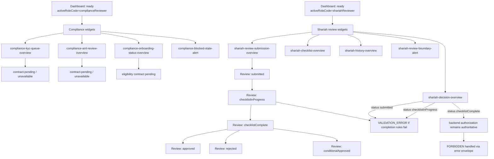

# Compliance and Review Dashboard Widget Contract

Status: Draft contract for PBI-180 review  
Owner: Frontend + Architecture + Compliance  
Related feature: PBI-017 — Role-based UI and operational dashboards  
Related story: PBI-148 — Compliance/review dashboard widgets  
Related task: PBI-180 — Define compliance or review widget contract, governed action mapping, and blocked-state rules  
Related implementation task: PBI-181 — Implement compliance or review dashboard widgets and governed workflow entry points  
Related hardening task: PBI-182 — Add blocked-action handling, permission filtering, and shared status-state hardening for compliance/review widgets  
Related validation task: PBI-183 — Execute compliance or review widget validation, documentation updates, and evidence closure  
Related requirements: R02, R17, R20  
Related decision record: `docs/architecture/adr/ADR-001-dashboard-auth-boundary-and-state-flow.md`

## 1. Purpose

This document defines the compliance/review dashboard widget contract and governed action mapping for PBI-148.

The goal is to give PBI-181 and PBI-182 one approved source for widget IDs, role visibility, action targets, blocked-state behavior, and summary-state semantics. Implementation must consume this contract rather than inventing role-specific widget behavior ad hoc.

## 2. Scope

### In scope

- Compliance/review widget IDs and placement zones.
- Role visibility rules for `complianceReviewer` and `shariahReviewer`.
- Governed action-entry mapping.
- Summary/status-state semantics.
- Blocked, unavailable, forbidden, validation, and empty-state behavior.
- Contract-backed Shariah review widget definitions.
- Contract-pending KYC/AML widget definitions.
- ADR-001 dashboard/auth-boundary alignment.
- Implementation guidance for PBI-181, PBI-182, and PBI-183.

### Out of scope

- Rendering implementation.
- Backend API changes.
- Backend authorization changes.
- Real authentication, session issuance, logout, or public account creation.
- KYC/AML backend workflow implementation.
- Onboarding eligibility API implementation.
- Administrator widgets.
- Auditor/security widgets.
- Buyer, supplier, or financing widgets.
- Advanced analytics widgets.
- High-fidelity UI redesign.

## 3. System and SRS context

The preliminary SRS defines the dashboard work inside a digital procurement system covering SME onboarding, KYC/AML, role-based dashboards, Shariah governance, audit, and PLS workflow support.

Relevant requirements:

- R02 — KYC/AML onboarding workflow.
- R17 — Role-based UI and dashboards.
- R20 — Shariah governance workflow for PLS approvals.
- R22 — Access logging and non-repudiation, where sensitive review reads or governed actions are audited.

The MVP remains centralized-first or hybrid. Widgets must surface workflow states and governed entry points without implying full blockchain, full KYC/AML automation, or full production authentication exists.

## 4. ADR-001 boundary

ADR-001 controls this widget contract.

Rules that apply:

- PBI-017 starts from resolved actor context; it does not implement login or account creation.
- Dashboard role labels do not grant backend privileges.
- Backend authorization remains authoritative for protected actions.
- Frontend forbidden states are UX guards only.
- `pendingReview` organizations require limited/status behavior, not full operational dashboards.
- `inactive`, `suspended`, and `deleted` organizations must not receive protected-write affordances.
- Widgets must be classified as contract-backed, contract-pending, or placeholder before implementation.

## 5. Role coverage

### 5.1 `complianceReviewer`

Purpose:

- Surface compliance review work such as KYC/AML queues, onboarding review placeholders, blocked/flagged status indicators, and governed review entry points.

Current contract posture:

- KYC/AML and onboarding eligibility widgets are contract-pending or placeholder unless PBI-002/PBI-150 contracts are available and explicitly consumed.
- Compliance reviewer widgets must not pretend that KYC/AML automation or eligibility enforcement exists when the backend contract is not stable.
- Compliance reviewer widgets may show placeholder queue/status cards and route to unavailable/placeholder targets until the contract stabilizes.

### 5.2 `shariahReviewer`

Purpose:

- Surface Shariah review workflow states and entry points: review submissions, checklist workspace, decision recording, and history/status review.

Current contract posture:

- Shariah review submission, checklist, decision, and history contracts are stable enough for contract-backed dashboard entry points.
- Final decision actions must respect the review state model: decisions are valid only from `checklistComplete`.
- The dashboard must not show final decision as available from `submitted` or `checklistInProgress` states.

### 5.3 Shared review visibility

Some review data may be visible to more than one role if the backend endpoint allows it. The dashboard contract may list shared visibility only when explicitly backed by a target registry or API contract.

Implementation rule:

- Frontend visibility must not override backend authorization.
- A widget can render an entry point, but protected reads/writes must still be enforced by backend services.

## 6. Widget readiness classification

| Widget area | Role | Classification | Reason |
|---|---|---|---|
| KYC queue | `complianceReviewer` | contract-pending / placeholder | KYC/AML workflow and eligibility seams are not fully stable in this branch. |
| AML review queue | `complianceReviewer` | contract-pending / placeholder | AML review implementation is outside PBI-180/PBI-181 unless explicitly provided by PBI-002/PBI-150. |
| Onboarding status/history | `complianceReviewer` | contract-pending / placeholder | Status vocabulary exists for member organizations, but review queue semantics are not fully approved here. |
| Flagged/blocked onboarding indicator | `complianceReviewer` | contract-pending / placeholder | Blocked/flagged reason metadata is expected to be refined by onboarding eligibility work. |
| Shariah review submissions | `shariahReviewer` | contract-backed | Shariah review submission contract exists. |
| Shariah checklist workspace | `shariahReviewer` | contract-backed | Checklist save/completion contract and states exist. |
| Shariah decision workspace | `shariahReviewer` | contract-backed | Decision contract exists and is valid only from `checklistComplete`. |
| Shariah review history | `shariahReviewer` | contract-backed | History/status contract exists. |
| Review authorization boundary alert | `complianceReviewer`, `shariahReviewer` | contract-backed | Backend authorization and error-envelope semantics are defined. |

## 7. Compliance/review widget model

Compliance/review widgets extend the base `DashboardWidget` contract with governed action semantics.

```typescript
interface ComplianceReviewDashboardWidget {
  id: string;
  title: string;
  zoneId: 'summary' | 'primary' | 'secondary' | 'actions' | 'alerts';
  allowedRoles: Array<'complianceReviewer' | 'shariahReviewer'>;
  status: 'placeholder' | 'loading' | 'active' | 'unavailable' | 'error';
  summaryState?: ReviewWidgetSummaryState;
  actionEntries: ReviewWidgetActionEntry[];
  dataExpectation: 'contractBacked' | 'contractPending' | 'placeholder';
  workflowStateSource?: 'memberOrganization' | 'kycAml' | 'shariahReview' | 'none';
  emptyState: {
    title: string;
    message: string;
  };
  errorState: {
    title: string;
    message: string;
  };
  downstreamPbi: 'PBI-181' | 'PBI-182' | 'PBI-183';
}
```

### 7.1 Summary state model

```typescript
type ReviewWidgetSummaryState =
  | 'ready'
  | 'empty'
  | 'partial'
  | 'unavailable'
  | 'contractPending'
  | 'forbidden'
  | 'validationBlocked'
  | 'error';
```

| State | Meaning | UI behavior |
|---|---|---|
| `ready` | Contract-backed data is available and safe to display. | Show workflow status and allowed actions. |
| `empty` | Query/read succeeded but no work items exist. | Show empty-state message, not an error. |
| `partial` | Some data is available but the full workflow summary is not available. | Show available data with partial-state note. |
| `unavailable` | Target exists but is not implemented or not consumable yet. | Show unavailable placeholder; do not route to fake page. |
| `contractPending` | Backend contract is not stable enough to implement real widget behavior. | Show contract-pending explanation and disable governed actions. |
| `forbidden` | Backend returns `FORBIDDEN` or actor lacks required backend authorization. | Show safe forbidden state using standard error-envelope semantics. |
| `validationBlocked` | Workflow action is invalid for current workflow state. | Show validation-blocked copy; do not present action as enabled. |
| `error` | Unexpected frontend/backend failure. | Show safe error state, no sensitive details. |

## 8. Compliance reviewer widgets

### 8.1 `compliance-kyc-queue-overview`

| Field | Value |
|---|---|
| Zone | `primary` |
| Purpose | Surface KYC onboarding review queue entry point. |
| Allowed role | `complianceReviewer` |
| Data expectation | `contractPending` |
| Supported states | `contractPending`, `unavailable`, `empty`, `forbidden`, `error` |
| Downstream implementation | PBI-181 |

Display rule:

- Do not fabricate queue counts.
- Do not claim automated KYC/AML review is complete.
- If the KYC/AML contract is not stable, render a contract-pending or placeholder state.

Action entries:

- `open-kyc-queue-placeholder`

### 8.2 `compliance-aml-review-overview`

| Field | Value |
|---|---|
| Zone | `primary` or `secondary` |
| Purpose | Surface AML review entry point where contract-supported. |
| Allowed role | `complianceReviewer` |
| Data expectation | `contractPending` |
| Supported states | `contractPending`, `unavailable`, `empty`, `forbidden`, `error` |
| Downstream implementation | PBI-181 |

Display rule:

- Treat as placeholder until AML review workflow contract is stable.
- Do not show real AML counts without an approved source.

Action entries:

- `open-aml-review-placeholder`

### 8.3 `compliance-onboarding-status-overview`

| Field | Value |
|---|---|
| Zone | `summary` or `secondary` |
| Purpose | Surface onboarding status/blocked-state context. |
| Allowed role | `complianceReviewer` |
| Data expectation | `contractPending` |
| Supported states | `contractPending`, `partial`, `unavailable`, `forbidden`, `error` |
| Downstream implementation | PBI-181/PBI-182 |

Permitted member organization status vocabulary:

- `pendingReview`
- `active`
- `inactive`
- `suspended`
- `deleted`

Display rule:

- The widget may reference known organization status vocabulary.
- It must not define downstream onboarding eligibility by itself.
- Blocked/flagged reason metadata must remain contract-pending until onboarding eligibility contracts are approved.

Action entries:

- `open-onboarding-status-placeholder`

### 8.4 `compliance-blocked-state-alert`

| Field | Value |
|---|---|
| Zone | `alerts` |
| Purpose | Warn that compliance widget visibility does not authorize governed action success. |
| Allowed role | `complianceReviewer` |
| Data expectation | `contractBacked` |
| Supported states | `ready` |
| Downstream implementation | PBI-181/PBI-182 |

Required message meaning:

```text
Compliance dashboard visibility is a frontend shell context. Backend authorization and governed workflow state remain authoritative.
```

## 9. Shariah reviewer widgets

### 9.1 `shariah-review-submission-overview`

| Field | Value |
|---|---|
| Zone | `primary` |
| Purpose | Route to Shariah review submission/review intake. |
| Allowed role | `shariahReviewer` |
| Data expectation | `contractBacked` |
| Supported states | `ready`, `empty`, `partial`, `forbidden`, `error` |
| Downstream implementation | PBI-181 |

Workflow states referenced:

- `submitted`
- `checklistInProgress`
- `checklistComplete`
- `approved`
- `rejected`
- `conditionalApproved`

Display rule:

- Submission/review intake may show available state if target registry supports the route.
- Protected submission/write actions must still be authorized by backend actor context.

Action entries:

- `open-shariah-review-submissions`

### 9.2 `shariah-checklist-overview`

| Field | Value |
|---|---|
| Zone | `primary` or `actions` |
| Purpose | Route to checklist workspace. |
| Allowed role | `shariahReviewer` |
| Data expectation | `contractBacked` |
| Supported states | `ready`, `empty`, `partial`, `validationBlocked`, `forbidden`, `error` |
| Downstream implementation | PBI-181 |

Checklist rules:

- Partial saves may remain `checklistInProgress`.
- `checklistComplete` requires all mandatory completion rules to pass.
- Completion failures must surface `VALIDATION_ERROR` semantics, not fake success.

Action entries:

- `open-shariah-checklist`

### 9.3 `shariah-decision-overview`

| Field | Value |
|---|---|
| Zone | `actions` or `primary` |
| Purpose | Route to decision recording when workflow state permits. |
| Allowed role | `shariahReviewer` |
| Data expectation | `contractBacked` |
| Supported states | `ready`, `validationBlocked`, `forbidden`, `error` |
| Downstream implementation | PBI-181/PBI-182 |

Decision rules:

- Decision recording is valid only from `checklistComplete`.
- `submitted` and `checklistInProgress` must block decision action with validation-blocked state.
- Final states (`approved`, `rejected`, `conditionalApproved`) are terminal unless a later reopen rule is approved.
- `conditionalApproved` requires conditions.

Action entries:

- `open-shariah-decision`

### 9.4 `shariah-history-overview`

| Field | Value |
|---|---|
| Zone | `secondary` |
| Purpose | Route to Shariah status/history view. |
| Allowed role | `shariahReviewer` |
| Data expectation | `contractBacked` |
| Supported states | `ready`, `empty`, `partial`, `forbidden`, `error` |
| Downstream implementation | PBI-181 |

History rules:

- Intermediate histories are valid and must not be treated as errors.
- Absence of a final decision is not an error.
- Sensitive history reads may be auditable and must respect backend authorization.

Action entries:

- `open-shariah-history`

### 9.5 `shariah-review-boundary-alert`

| Field | Value |
|---|---|
| Zone | `alerts` |
| Purpose | Warn that frontend review visibility does not grant backend decision authority. |
| Allowed role | `shariahReviewer` |
| Data expectation | `contractBacked` |
| Supported states | `ready` |
| Downstream implementation | PBI-181/PBI-182 |

Required message meaning:

```text
Review dashboard visibility is not backend authorization. Checklist and decision actions remain governed by backend state and actor context.
```

## 10. Governed action-entry contract

```typescript
interface ReviewWidgetActionEntry {
  id: string;
  label: string;
  target: string;
  zoneId: 'summary' | 'primary' | 'secondary' | 'actions' | 'alerts';
  allowedRoles: Array<'complianceReviewer' | 'shariahReviewer'>;
  workflowStateGuard?: {
    source: 'memberOrganization' | 'shariahReview' | 'kycAml';
    allowedStates: string[];
    blockedStates: string[];
  };
  availability: 'available' | 'placeholder' | 'contractPending' | 'blocked';
  navigationBehavior: 'navigate' | 'showUnavailable' | 'showContractPending' | 'showForbidden' | 'showValidationBlocked';
  backendAuthorization: 'requiredForProtectedAction' | 'requiredForSensitiveRead' | 'notApplicableForNavigationOnly';
  blockedStateMessage: string;
}
```

## 11. Approved action entries

| Action ID | Label | Target | Allowed role | Availability | Navigation behavior | Backend authorization note |
|---|---|---|---|---|---|---|
| `open-kyc-queue-placeholder` | KYC Queue | `kyc-queue` | `complianceReviewer` | `contractPending` | `showContractPending` or `showUnavailable` | Do not claim KYC workflow completion until contract stabilizes. |
| `open-aml-review-placeholder` | AML Reviews | `aml-reviews` | `complianceReviewer` | `contractPending` | `showContractPending` or `showUnavailable` | Do not fabricate AML review data. |
| `open-onboarding-status-placeholder` | Onboarding Status | `onboarding-status` | `complianceReviewer` | `contractPending` | `showContractPending` or `showUnavailable` | Eligibility/blocked reason metadata awaits downstream contract. |
| `open-shariah-review-submissions` | Shariah Reviews | `shariah-reviews` | `shariahReviewer` | `available` | `navigate` | Protected writes still require backend authorization. |
| `open-shariah-checklist` | Shariah Checklist | `shariah-checklists` | `shariahReviewer` | `available` | `navigate` | Checklist completion rules determine valid state transitions. |
| `open-shariah-decision` | Shariah Decision | `shariah-decisions` | `shariahReviewer` | `available` | `navigate` or `showValidationBlocked` | Decision valid only from `checklistComplete`. |
| `open-shariah-history` | Shariah History | `shariah-history` | `shariahReviewer` | `available` | `navigate` | Sensitive read access remains backend-authorized. |

## 12. Role visibility and blocked-action rules

### 12.1 Normal rendering

- `complianceReviewer` widgets render only when active dashboard role is `complianceReviewer`.
- `shariahReviewer` widgets render only when active dashboard role is `shariahReviewer`.
- Shared widgets must explicitly list both roles in `allowedRoles`.
- Widgets must still pass the dashboard shell render-time filter.
- Widgets must not be merged across roles because of multi-role priority.

### 12.2 Direct access

- Direct access to a known review target outside the active role must render dashboard `forbidden`.
- Direct access to contract-pending KYC/AML targets must render unavailable or contract-pending state.
- Direct access to Shariah decision target is navigation-only; action validity must still be enforced inside the page/backend by workflow state.

### 12.3 Backend-protected actions

- Frontend widgets may expose governed entry points only.
- Backend services remain authoritative for protected writes and sensitive reads.
- If the backend returns `FORBIDDEN`, widgets/pages must display a safe error-envelope-derived state.
- If the backend returns `VALIDATION_ERROR` because the workflow state is invalid, widgets/pages must not reinterpret it as success.
- The frontend must not inject `x-actor-role`, `x-actor-id`, or other client-authored actor identity as authorization source.

## 13. Summary and status-state honesty rules

- Do not fabricate KYC/AML queue counts.
- Do not fabricate blocked/flagged onboarding counts.
- Do not fabricate Shariah review status counts unless an approved list/summary source is consumed.
- If only route targets exist, show action-entry widgets rather than metric cards.
- Missing data source means `unavailable` or `contractPending`, not zero.
- Empty result from a stable backend source means `empty`, not error.
- Intermediate Shariah workflow states are valid and must be represented honestly.

## 14. State-flow sketch



## 15. Implementation guidance for PBI-181

PBI-181 should:

- implement widgets using the IDs in this contract;
- keep KYC/AML widgets as contract-pending or placeholder unless a stable backend contract is explicitly consumed;
- implement Shariah review widgets using approved route targets only;
- route widget actions through the central dashboard page-change handler;
- preserve `resolveDashboardTargetAccess(...)` behavior;
- avoid fabricating summary counts;
- keep backend authorization and workflow validation authoritative;
- not implement administrator, auditor/security, buyer, supplier, or financier widgets.

Recommended initial widget set for PBI-181:

- `compliance-kyc-queue-overview` as contract-pending placeholder;
- `compliance-aml-review-overview` as contract-pending placeholder;
- `compliance-blocked-state-alert`;
- `shariah-review-submission-overview`;
- `shariah-checklist-overview`;
- `shariah-decision-overview`;
- `shariah-history-overview`;
- `shariah-review-boundary-alert`.

## 16. Hardening guidance for PBI-182

PBI-182 should validate and harden:

- role-only visibility for `complianceReviewer` widgets;
- role-only visibility for `shariahReviewer` widgets;
- mixed-widget-array defensive filtering;
- contract-pending behavior for KYC/AML widgets;
- `memberOrganization` status references not becoming eligibility enforcement;
- decision action blocked state when review status is not `checklistComplete`;
- forbidden/error-envelope handling for backend-denied review actions;
- summary-state honesty.

## 17. Validation guidance for PBI-183

PBI-183 evidence should include:

- implemented compliance/review widget IDs;
- role visibility matrix;
- action-entry mapping table;
- KYC/AML contract-pending evidence;
- Shariah review workflow state evidence;
- decision blocked-state evidence;
- backend authorization boundary evidence;
- validation command results;
- known limitations and follow-up recommendations.

## 18. ADR need

No new ADR is required for this contract.

This document does not change:

- dashboard auth boundary;
- API response semantics;
- state model semantics;
- role vocabulary;
- widget-zone model;
- backend authorization rules.

It specializes compliance/review widget behavior within the already-approved dashboard shell and ADR-001 boundaries.
