# Dashboard State-Flow Recommendations

Status: Draft recommendation for Scrum Master / Product Owner review  
Owner: Frontend + Architecture + Scrum Master  
Related feature: PBI-017 — Role-based UI and operational dashboards  
Related requirement: R17 — Role-based UI and dashboards  
Related source files:
- `docs/drafts/Pre-SRS-v3.pdf`
- `docs/contracts/API_CONTRACTS.md`
- `docs/architecture/STATE_MODELS.md`
- `docs/architecture/dashboard-state-flow.mermaid`

## 1. Purpose

This document records the recommended UI state-flow model for the PBI-017 role-based dashboard and the assumptions that must be resolved before high-fidelity UI work or major frontend refactoring continues.

The recommendation is intentionally state-first. The low-fidelity Figma prototype should be derived from these states instead of inventing screen flows visually.

## 2. Context from SRS

The dashboard must represent the actual software system, not a generic admin panel.

The preliminary SRS defines the product scope as:

- SME onboarding and identity
- procure-to-pay lifecycle tracking
- permissioned or hybrid blockchain auditability
- PLS product support and receivable financing seedbed
- Shariah review and governance
- audit, regulatory reporting, and access logging

The SRS also constrains the MVP to a centralized-first or hybrid architecture. A full permissioned blockchain deployment is not assumed for the MVP. Blockchain usage should be limited to integrity verification, proof anchoring, or selective audit evidence where justified.

## 3. Existing contract facts

The following facts are already present in `API_CONTRACTS.md` and `STATE_MODELS.md` and should constrain the UI flow.

### 3.1 Authentication and actor context

Current contract facts:

- Protected endpoints expect `Authorization: Bearer <token>`.
- Protected flows assume a stable authenticated user context.
- Actor identity for protected writes and sensitive reads must come from trusted server-side request context.
- Client-supplied actor headers may exist as scaffolding but are not authoritative public-contract inputs.

Recommendation:

- UI may include conceptual login and account-creation states for design purposes.
- Do not treat these as implemented API contracts until authentication/session endpoints are formally defined.
- Do not make frontend dashboard role selection imply backend authorization.

### 3.2 Member organization lifecycle

Current states:

- `pendingReview`
- `active`
- `inactive`
- `suspended`
- `deleted`

Key rules:

- New organizations provisionally start as `pendingReview`.
- `active` organizations may operate if authorization also passes.
- `pendingReview`, `inactive`, and `suspended` organizations are blocked from protected actions.
- `deleted` organizations may not initiate new operational actions.

Recommendation:

- The frontend should show an explicit limited/pending state for `pendingReview` rather than routing directly to a full operational dashboard.
- Protected write buttons should either be hidden or route to a safe blocked state when the organization is not `active`.

### 3.3 User lifecycle

Current states:

- `active`
- `inactive`

Recommendation:

- `inactive` users should resolve to an access-blocked state before dashboard role selection.
- Historical visibility can remain possible where a backend endpoint permits it, but protected writes must be blocked.

### 3.4 Role and role-assignment lifecycle

Role states:

- `active`
- `inactive`

Role assignment states:

- `active`
- `revoked`

Recommendation:

- Only active role assignments should influence dashboard role resolution.
- Revoked role assignments should remain historical and should not grant dashboard access.
- Inactive roles should not appear as assignable in UI controls.

### 3.5 Shariah review workflow

Current workflow states:

- `submitted`
- `checklistInProgress`
- `checklistComplete`
- `approved`
- `rejected`
- `conditionalApproved`

Key transition rules:

- New accepted reviews begin as `submitted`.
- Checklist saves may keep the review in `checklistInProgress`.
- Checklist completion requires all mandatory completion rules to pass.
- Final decisions are valid only from `checklistComplete`.
- `approved`, `rejected`, and `conditionalApproved` are final states for Sprint 1.

Recommendation:

- UI must not show approval/rejection actions before `checklistComplete`.
- If a decision is attempted from `submitted` or `checklistInProgress`, the UI should display a validation state instead of pretending the action is allowed.

### 3.6 Dashboard shell states

Current shell states:

- `ready`
- `noRole`
- `unsupportedRole`
- `forbidden`
- `loading`
- `error`

Recommendation:

- These states should remain the outer shell state machine.
- Business workflow state should be rendered inside the relevant component only after the shell reaches `ready`.
- `forbidden` is a frontend UX guard only; backend authorization remains authoritative.

## 4. Recommended state-tree model

The recommended high-level tree is:

```text
Entry / Auth
├── Login
│   ├── Authenticated Session
│   │   ├── User active
│   │   │   ├── Dashboard role resolution
│   │   │   │   ├── ready
│   │   │   │   │   ├── Membership / RBAC component
│   │   │   │   │   ├── Supplier component
│   │   │   │   │   ├── Buyer component
│   │   │   │   │   ├── Financing component
│   │   │   │   │   ├── Compliance component
│   │   │   │   │   ├── Shariah review component
│   │   │   │   │   └── Audit / access-history component
│   │   │   │   ├── noRole
│   │   │   │   ├── unsupportedRole
│   │   │   │   ├── forbidden
│   │   │   │   └── error
│   │   │   └── Organization state gate
│   │   │       ├── pendingReview
│   │   │       ├── active
│   │   │       ├── inactive
│   │   │       ├── suspended
│   │   │       └── deleted
│   │   └── User inactive
│   ├── Auth error
│   └── Auth unavailable
└── Account creation / onboarding
    ├── Validation error
    ├── Conflict
    └── Member Organization: pendingReview
        ├── Compliance review
        │   ├── active
        │   └── suspended
        └── Protected write blocked
```

## 5. Recommended Mermaid diagram

The source Mermaid chart is committed separately at:

```text
/docs/architecture/dashboard-state-flow.mermaid
```

Rendered form:

```mermaid
flowchart TD
  Entry["Entry"] --> Auth["Auth Screen"]

  Auth -->|"Submit credentials"| Authenticating["Authenticating"]
  Auth -->|"Create account / onboarding"| OnboardingForm["Registration / Onboarding Screen"]

  Authenticating -->|"Accepted"| Session["Session Context"]
  Authenticating -->|"Invalid credentials"| AuthError["Auth Error"]
  Authenticating -->|"Service unavailable"| AuthUnavailable["Auth Unavailable"]
  AuthError --> Auth
  AuthUnavailable --> Auth

  OnboardingForm -->|"Submit details"| RegistrationSubmitted["Registration Submitted"]
  RegistrationSubmitted -->|"Validation failed"| RegistrationValidationError["Registration Validation Error"]
  RegistrationSubmitted -->|"Duplicate registrationNumber"| RegistrationConflict["Registration Conflict"]
  RegistrationSubmitted -->|"Member organization created"| OrgPending["Member Organization: pendingReview"]
  RegistrationValidationError --> OnboardingForm
  RegistrationConflict --> OnboardingForm

  Session -->|"Resolve server-derived user context"| UserState{"User state"}
  UserState -->|"inactive"| AccessBlocked["Access Blocked"]
  UserState -->|"active"| DashboardRole{"Dashboard role resolution"}

  DashboardRole -->|"No assigned role"| DashboardNoRole["Dashboard: noRole"]
  DashboardRole -->|"Unsupported roleCode"| DashboardUnsupported["Dashboard: unsupportedRole"]
  DashboardRole -->|"Supported roleCode"| OrgState{"Organization state"}

  OrgState -->|"pendingReview"| OrgPending
  OrgState -->|"inactive"| OrgInactive["Member Organization: inactive"]
  OrgState -->|"suspended"| OrgSuspended["Member Organization: suspended"]
  OrgState -->|"deleted"| OrgDeleted["Member Organization: deleted"]
  OrgState -->|"active"| DashboardReady["Dashboard: ready"]

  DashboardReady --> Membership["Membership / RBAC Component"]
  DashboardReady --> Supplier["Supplier Component"]
  DashboardReady --> Buyer["Buyer Component"]
  DashboardReady --> Financing["Financing Component"]
  DashboardReady --> Compliance["Compliance Component"]
  DashboardReady --> Shariah["Shariah Review Component"]
  DashboardReady --> Audit["Audit / Access History Component"]

  Membership -->|"Create organization"| OrgPending
  Membership -->|"Activate organization"| OrgActive["Member Organization: active"]
  Membership -->|"Assign role"| AssignmentActive["Role Assignment: active"]
  Membership -->|"Revoke role"| AssignmentRevoked["Role Assignment: revoked"]

  Compliance -->|"Approve case"| OrgActive
  Compliance -->|"Flag / suspend case"| OrgSuspended

  Shariah -->|"Submit review"| ReviewSubmitted["Review: submitted"]
  ReviewSubmitted -->|"Save checklist"| ReviewProgress["Review: checklistInProgress"]
  ReviewProgress -->|"Save partial checklist"| ReviewProgress
  ReviewProgress -->|"Completion rules pass"| ReviewComplete["Review: checklistComplete"]
  ReviewProgress -->|"Completion rules fail"| ValidationError["VALIDATION_ERROR"]
  ReviewSubmitted -->|"Decision attempted"| ValidationError
  ReviewComplete -->|"Approve"| ReviewApproved["Review: approved"]
  ReviewComplete -->|"Reject"| ReviewRejected["Review: rejected"]
  ReviewComplete -->|"Conditional approve"| ReviewConditional["Review: conditionalApproved"]

  Audit -->|"Query history"| AccessHistory["Access History Results"]
  Audit -->|"Query sequence"| AccessSequence["Access Event Sequence"]
  Audit -->|"No records"| EmptyResult["Empty Result"]

  DashboardReady -->|"Known route outside role"| DashboardForbidden["Dashboard: forbidden"]
  DashboardReady -->|"Unknown / unavailable target"| DashboardError["Dashboard: error"]
  DashboardReady -->|"Protected action denied by backend"| BackendForbidden["Backend: FORBIDDEN"]

  AccessBlocked --> BackendForbidden
  OrgPending -->|"Protected write attempted"| BackendForbidden
  OrgInactive -->|"Protected write attempted"| BackendForbidden
  OrgSuspended -->|"Protected write attempted"| BackendForbidden
  OrgDeleted -->|"Operational action attempted"| BackendForbidden
```



## 6. Design guidance for future Figma iteration

Future low-fidelity frames should be tree-structured.

Recommended visual rules:

- Frames should represent system components or states only.
- Do not put explanatory workflow prose inside product frames.
- Put explanations, assumptions, and traceability notes outside the frames as annotations.
- Use connectors or labels outside frames to describe transitions.
- Start with state change first, then create low-fidelity component frames.

Recommended tree layout:

```text
Auth / Entry
├── Session resolution
│   ├── Dashboard shell states
│   └── Backend forbidden state
└── Account creation / onboarding
    └── Organization pending review
        └── Compliance resolution

Dashboard ready
├── Membership / RBAC
├── Supplier
├── Buyer
├── Financing
├── Compliance
├── Shariah Review
└── Audit / Access History
```

## 7. Open decisions for Scrum Master / PO

### 7.1 Authentication and self-registration contract

Question:

- Is account creation a public self-service SME onboarding flow, an administrator-created organization flow, or both?

Reason:

- Current API contracts define protected bearer-auth assumptions and member organization creation, but do not define public login/register endpoints.

Recommendation:

- Create a separate enabler for frontend auth/session model before making login/create-account screens production-like.

### 7.2 Organization-state gate before dashboard access

Question:

- Should `pendingReview` organizations see a limited dashboard, a blocked dashboard, or only an onboarding status screen?

Recommendation:

- Use limited dashboard/status screen for `pendingReview`.
- Block protected writes until organization becomes `active`.

### 7.3 Dashboard role vocabulary vs backend role catalog

Question:

- Should dashboard role codes such as `administrator` be formally mapped to backend role codes such as `admin`, or should the backend role vocabulary be aligned later?

Recommendation:

- Keep a documented mapping seam.
- Do not allow frontend role codes to grant backend privileges.

### 7.4 Scope of buyer/supplier/financier screens in MVP

Question:

- Should buyer, supplier, and financier dashboards remain placeholders under PBI-146, or should specific workflow stories be added before high-fidelity UI work?

Recommendation:

- Keep placeholders until procure-to-pay and financing backend contracts are defined or prioritized.

### 7.5 Figma low-fidelity prototype acceptance rule

Question:

- Should Figma prototype acceptance require clickable interactions, or is a state-tree frame map sufficient for Sprint 5?

Recommendation:

- Accept state-tree frame map first.
- Add click-through only after the state tree is approved.

## 8. Recommended next action

1. Scrum Master / PO reviews this document.
2. Resolve open decisions in section 7.
3. Update `API_CONTRACTS.md` or create an auth/session enabler if needed.
4. Rebuild the low-fidelity Figma prototype as a tree using `dashboard-state-flow.mermaid` as the source.
5. Only after the tree is approved, proceed to visual UI layout refinement.
