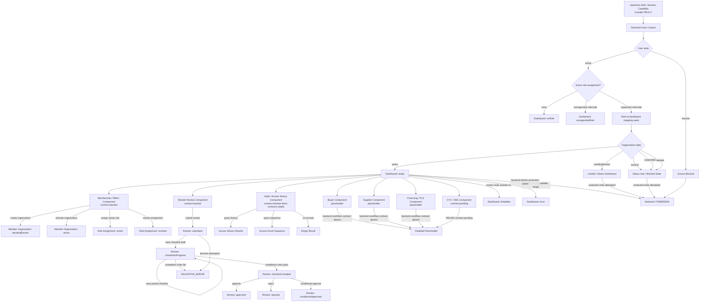

# Dashboard State-Flow Recommendations

Status: ADR-aligned reference for PBI-017 implementation  
Owner: Frontend + Architecture + Scrum Master  
Related feature: PBI-017 — Role-based UI and operational dashboards  
Related requirement: R17 — Role-based UI and dashboards  
Related decision record: `docs/architecture/adr/ADR-001-dashboard-auth-boundary-and-state-flow.md`  
Related source files:
- `docs/drafts/Pre-SRS-v3.pdf`
- `docs/contracts/API_CONTRACTS.md`
- `docs/architecture/STATE_MODELS.md`
- `docs/architecture/dashboard-state-flow.mermaid`

## 1. Purpose

This document records the ADR-aligned UI state-flow model for the PBI-017 role-based dashboard.

It exists as a working reference for future dashboard implementation, Figma iteration, and Aider task prompts. It supersedes earlier draft wording that treated login, account creation, or public self-registration as dashboard-owned state.

## 2. ADR-001 decision summary

ADR-001 is the controlling decision for PBI-017 dashboard state flow.

ADR-001 decides that:

1. PBI-017 starts only after a trusted authenticated actor context exists.
2. PBI-017 must not implement full authentication, login, session issuance, logout, public account creation, or public SME self-registration.
3. Authentication/session management must be handled by a separate backlog item or already-approved platform capability.
4. The dashboard may consume a session or actor-context contract, but must not define that contract.
5. Dashboard role resolution must use server-derived actor context and backend role/assignment data.
6. Frontend role labels must not grant backend privileges.
7. Backend authorization remains authoritative for protected actions.
8. `pendingReview` organizations must see a limited/status dashboard or onboarding-status experience, not the full operational dashboard.
9. `inactive`, `suspended`, and `deleted` organizations must not receive operational protected-write affordances.
10. Buyer, supplier, and financier areas may exist only as placeholders or disabled components until their backend workflow contracts are approved.

## 3. Context from SRS

The dashboard must represent the actual software system, not a generic admin panel.

The preliminary SRS defines the product scope as:

- SME onboarding and identity
- procure-to-pay lifecycle tracking
- permissioned or hybrid blockchain auditability
- PLS product support and receivable financing seedbed
- Shariah review and governance
- audit, regulatory reporting, and access logging

The SRS also constrains the MVP to a centralized-first or hybrid architecture. A full permissioned blockchain deployment is not assumed for the MVP. Blockchain usage should be limited to integrity verification, proof anchoring, or selective audit evidence where justified.

## 4. PBI-017 state-flow boundary

### In boundary

PBI-017 may own:

- dashboard shell states
- role-to-dashboard mapping
- role-to-widget visibility mapping
- organization-state dashboard gate behavior
- limited/status dashboard for `pendingReview` organizations
- UX-level `noRole`, `unsupportedRole`, `forbidden`, `loading`, and `error` states
- placeholder rendering for backend-contract-pending areas
- contract-backed widgets where backend contracts are stable

### Out of boundary

PBI-017 must not own:

- login endpoint implementation
- session or token issuance
- logout or session invalidation
- public account creation
- public SME self-registration
- password recovery
- MFA
- SSO or external identity-provider rollout
- backend authorization rules beyond consuming already-approved protected-action contracts

## 5. Existing contract facts

The following facts are already present in `API_CONTRACTS.md`, `STATE_MODELS.md`, and ADR-001 and should constrain the UI flow.

### 5.1 Authentication and actor context

Current contract facts:

- Protected endpoints expect `Authorization: Bearer <token>`.
- Protected flows assume a stable authenticated user context.
- Actor identity for protected writes and sensitive reads must come from trusted server-side request context.
- Client-supplied actor headers may exist as scaffolding but are not authoritative public-contract inputs.

ADR-aligned recommendation:

- Figma and frontend state-flow work should start from `Resolved Actor Context`, not from a login screen.
- Login and account creation may appear only as upstream/out-of-scope annotations.
- Do not treat authentication/session states as PBI-017 deliverables.
- Do not make frontend dashboard role selection imply backend authorization.

### 5.2 Member organization lifecycle

Current states:

- `pendingReview`
- `active`
- `inactive`
- `suspended`
- `deleted`

Key rules:

- New organizations provisionally start as `pendingReview`.
- `active` organizations may operate if authorization also passes.
- `pendingReview`, `inactive`, and `suspended` organizations are blocked from protected actions.
- `deleted` organizations may not initiate new operational actions.

ADR-aligned recommendation:

- `pendingReview` organizations should see a limited/status dashboard, not a full operational dashboard.
- `inactive`, `suspended`, and `deleted` organizations should route to blocked or status-only states for operational actions.
- Protected write affordances should be hidden or disabled when organization state is not operational.

### 5.3 User lifecycle

Current states:

- `active`
- `inactive`

ADR-aligned recommendation:

- `inactive` users should resolve to an access-blocked state before dashboard role selection.
- Historical visibility may remain possible only where a backend endpoint permits it.
- Protected writes must remain blocked.

### 5.4 Role and role-assignment lifecycle

Role states:

- `active`
- `inactive`

Role assignment states:

- `active`
- `revoked`

ADR-aligned recommendation:

- Only active role assignments should influence dashboard role resolution.
- Revoked role assignments remain historical and must not grant dashboard access.
- Inactive roles must not appear as assignable controls in dashboard UI.
- Dashboard role codes must pass through an explicit role-to-dashboard mapping seam.

### 5.5 Shariah review workflow

Current workflow states:

- `submitted`
- `checklistInProgress`
- `checklistComplete`
- `approved`
- `rejected`
- `conditionalApproved`

Key transition rules:

- New accepted reviews begin as `submitted`.
- Checklist saves may keep the review in `checklistInProgress`.
- Checklist completion requires all mandatory completion rules to pass.
- Final decisions are valid only from `checklistComplete`.
- `approved`, `rejected`, and `conditionalApproved` are final states for Sprint 1.

Recommendation:

- UI must not show approval/rejection actions before `checklistComplete`.
- If a decision is attempted from `submitted` or `checklistInProgress`, the UI should display a validation state instead of pretending the action is allowed.

### 5.6 Dashboard shell states

Current shell states:

- `ready`
- `noRole`
- `unsupportedRole`
- `forbidden`
- `loading`
- `error`

ADR-aligned recommendation:

- These states should remain the outer shell state machine.
- Business workflow state should be rendered inside the relevant component only after the shell reaches `ready`.
- `forbidden` is a frontend UX guard only.
- Backend authorization remains authoritative.

## 6. Recommended state-tree model

The ADR-aligned high-level tree is:

```text
Upstream Auth / Session Capability
└── Resolved Actor Context
    ├── User inactive
    │   └── Access Blocked
    └── User active
        └── Active role assignment gate
            ├── no active assignments
            │   └── Dashboard: noRole
            ├── unsupported roleCode
            │   └── Dashboard: unsupportedRole
            └── supported roleCode
                └── Role-to-dashboard mapping seam
                    └── Organization state gate
                        ├── pendingReview
                        │   └── Limited / Status Dashboard
                        ├── active
                        │   └── Dashboard: ready
                        │       ├── Membership / RBAC component
                        │       ├── Shariah Review component
                        │       ├── Audit / Access History component
                        │       ├── KYC / AML component placeholder
                        │       ├── Buyer component placeholder
                        │       ├── Supplier component placeholder
                        │       └── Financing / PLS component placeholder
                        ├── inactive
                        │   └── Status-only / Blocked State
                        ├── suspended
                        │   └── Status-only / Blocked State
                        └── deleted
                            └── Status-only / Blocked State
```

## 7. Recommended Mermaid diagram

The source Mermaid chart is committed separately at:

```text
/docs/architecture/dashboard-state-flow.mermaid
```

Rendered form:



## 8. Widget readiness matrix

ADR-001 requires dashboard widgets to be classified before implementation.

| Widget area | Classification | Implementation guidance |
|---|---|---|
| Membership / RBAC | contract-backed | May consume completed membership and access-control baseline. |
| Shariah Review | contract-backed | May consume Shariah review submission, checklist, decision, and history contracts. |
| Audit / Access History | contract-backed when contracts stable | May consume access-history contracts when relevant PBIs are stable; must not reopen PBI-022 scope. |
| KYC / AML | contract-pending | Depends on PBI-002 contracts stabilizing. |
| Buyer | placeholder | Requires procure-to-pay contracts. |
| Supplier | placeholder | Requires supplier/procurement workflow contracts. |
| Financing / PLS | placeholder | Requires escrow, PLS, receivables, and financing contracts. |

## 9. Design guidance for future Figma iteration

Future low-fidelity frames should be tree-structured and ADR-aligned.

Recommended visual rules:

- Start from `Resolved Actor Context`, not login.
- Frames should represent system components or states only.
- Do not put explanatory workflow prose inside product frames.
- Put explanations, assumptions, and traceability notes outside the frames as annotations.
- Use connectors or labels outside frames to describe transitions.
- Start with state change first, then create low-fidelity component frames.
- Buyer, supplier, and financing frames should appear as disabled/placeholder nodes until backend contracts exist.

Recommended tree layout:

```text
Resolved Actor Context
├── User State Gate
├── Role Assignment Gate
└── Organization State Gate
    ├── Limited / Status Dashboard
    ├── Blocked / Status-only State
    └── Dashboard Ready
        ├── Contract-backed components
        └── Placeholder components
```

## 10. Open follow-up needs

### 10.1 Authentication/session backlog item

ADR-001 requires a separate backlog item for login, session/token issuance, logout/session invalidation, and authenticated request validation if one does not already exist.

PBI-017 should consume that capability when available rather than implementing it directly.

### 10.2 Role-to-dashboard mapping seam

The dashboard must explicitly map backend role assignments to dashboard role profiles.

Open implementation consideration:

- dashboard roleCode `administrator` must not be treated as automatic backend `admin` privilege.
- backend authorization must remain authoritative.

### 10.3 Organization-state gate tests

Future implementation should include tests or evidence for:

- `pendingReview` limited/status state
- inactive user blocked state
- inactive organization blocked/status-only state
- suspended organization blocked/status-only state
- deleted organization blocked/status-only state

### 10.4 Placeholder classification tests/evidence

Future implementation should include evidence that buyer, supplier, financing, and KYC/AML areas are disabled or placeholder where backend contracts are pending.

## 11. Recommended next action

1. Use ADR-001 as the controlling decision.
2. Use this document and `dashboard-state-flow.mermaid` as implementation references.
3. Rebuild the low-fidelity Figma prototype as a tree from `Resolved Actor Context`.
4. Do not add login/account creation screens to PBI-017 UI work except as out-of-scope annotations.
5. Implement or document dashboard state behavior before adding high-fidelity UI polish.
