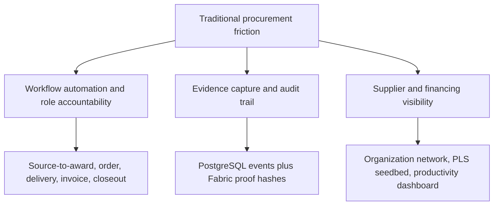

# Business Problem Tree

This file connects traditional procurement problems to the current repository capability, evidence, and remaining gap.

| Traditional procurement pain point | System capability | Actor affected | Current implementation | Evidence | Remaining gap |
|---|---|---|---|---|---|
| Manual handoffs | Source-to-award, order acknowledgement, delivery evidence, invoice review, closeout | Requesting user, procurement officer, supplier, finance officer | `src/modules/procurement` routes and services cover requisition, RFQ, quotation, award, order, evidence, invoice, and closeout | `docs/evidence/qa/PBI-498_SOURCE_TO_AWARD_VALIDATION.md`, `PBI-499_INVOICE_MATCH_VALIDATION.md`, `PBI-500_SUPPLIER_CLOSEOUT_VALIDATION.md` | Real stakeholder UAT and production workflow configuration remain future work. |
| Fragmented supplier data | Member organizations, organization profile, KYC/AML cases, organization network graph | Administrator, compliance reviewer, buyer, supplier | Membership, onboarding, and network modules create safe organization views | `docs/contracts/ORGANIZATION_NETWORK_CONTRACT.md`, `docs/evidence/qa/PBI-463_TO_PBI-472_ORGANIZATION_NETWORK_VALIDATION.md` | External registry, DID, and production verification are deferred. |
| Poor spend visibility | Company productivity money tracker and ledger exports | Finance officer, organization admin, buyer | Productivity read model derives from procurement records where present and labels projection fallback | `docs/evidence/qa/PRODUCTIVITY_MONEY_TRACKER_VALIDATION.md`, `docs/evidence/qa/ISSUE27_MERGE_GATE_HARDENING_VALIDATION.md` | Saved views/task completion are still process-local unless future durable sync is required. |
| Maverick buying | Role-scoped procurement flows, source-to-award, authorization checks | Procurement officer, administrator, auditor | Backend authorization and audit events constrain governed actions | `docs/evidence/qa/PBI-425_AUTHORIZATION_REGRESSION_MATRIX.md`, `src/modules/procurement/api/issue26-workflow.routes.test.ts` | Policy rules such as spend thresholds and catalog compliance are not yet production configurable. |
| Contract leakage | Contract negotiation, machine-readable terms, terms hash | Buyer, supplier, legal/procurement reviewer | `src/modules/contracts` stores contract metadata, offers, acceptance, and terms hash | `docs/contracts/CONTRACT_NEGOTIATION_MODEL_CONTRACT.md`, `docs/evidence/qa/PBI-450_451_CONTRACT_NEGOTIATION_MODEL_VALIDATION.md` | Legal redlining, production signature, and ERP obligation tracking remain future work. |
| Invoice exceptions and duplicate payment risk | Invoice metadata, three-way match, payment-readiness approval | Supplier, buyer, finance officer, financier | `src/modules/procurement/application/invoice-service.ts` and Postgres invoice repository | `docs/evidence/qa/PBI-499_INVOICE_MATCH_VALIDATION.md`, migration `019_issue26_workflow_persistence.sql` | Real AP integration and bank payment execution are not implemented. |
| Weak auditability | Access audit, transaction history, proof anchoring, export bundles | Auditor, regulator, security operator | Audit events are stored in PostgreSQL and selected hashes are proof-anchored | `docs/evidence/qa/PBI-323_BLOCKCHAIN_GATEWAY_VALIDATION.md`, `PBI-406_EXPORT_WORKFLOW_VALIDATION.md`, `ISSUE27_MERGE_GATE_HARDENING_VALIDATION.md` | Production retention, legal hold, and regulator portal integration are not claimed. |
| Supplier financing gap | Restricted PLS seedbed, Shariah review, financier dashboard, PLS scenario simulator | Supplier, financier, Shariah reviewer | Financing and Shariah modules show contract status, approval, certificate artifacts, and distribution scenarios | `docs/evidence/qa/PBI-393_PLS_SHARIAH_WORKFLOW_VALIDATION.md`, `PLS_SCENARIO_SIMULATOR_VALIDATION.md` | No formal Shariah certification, capital release, or payment execution. |
| Information asymmetry in Mudarabah | Procurement documentation, proof trail, Shariah decision, financier visibility | Financier, supplier, Shariah reviewer | PLS seedbed links procurement evidence to Shariah governance and simulated distributions | `docs/demo/AMANAH_BARAKAH_MABRUR_CASE.md` | True financial accounting, loss treatment, and external governance remain future work. |
| Weak procurement documentation | Document metadata, extraction, contract JSON, export bundle | Buyer, supplier, auditor, regulator | Document upload/extraction seams and local storage adapter exist | `docs/contracts/DOCUMENT_UPLOAD_EXTRACTION_CONTRACT.md`, `PBI-445_446_DOCUMENT_EXTRACTION_SIGNATURE_VALIDATION.md` | Production object storage, OCR, malware scanning, and legal signature verification are not implemented. |
| Poor supplier performance feedback | Procurement closeout and supplier performance scorecard | Buyer, supplier, procurement officer | Closeout derives performance from order, evidence, invoice, proof, and closeout record | `docs/evidence/qa/PBI-500_SUPPLIER_CLOSEOUT_VALIDATION.md` | Real historical supplier benchmark data is not present. |

## Product Owner Takeaway

The direction is still aligned with the research: most value comes from workflow depth, evidence integrity, and actor accountability. Blockchain is used defensibly as proof infrastructure, not as the operational database.
