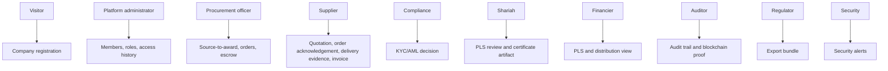

# Actor Goal Tree

Status terms: PASS means executable for the current supervisor-demo/pilot-hardening boundary; PARTIAL means useful but not production complete; MISSING means no executable path; DEFERRED means intentionally out of scope.

| Actor | Business goal | UI route | API route | Database tables/repositories | Proof/audit impact | Status |
|---|---|---|---|---|---|---|
| Visitor / company representative | Understand product and register organization | Landing, Company Registration | `POST /api/v1/organizations/register` | organization network/profile repositories | Creates pending organization metadata; no proof claim | PASS |
| Platform administrator | Govern organizations, users, roles, and access evidence | Dashboard, Members, Roles, Access History | membership, roles, access history routes | member organizations, roles, role assignments, access audit | Denied and successful admin actions are auditable | PASS |
| Organization administrator | Maintain organization profile and users | Company Dashboard, Company Users, Settings | `/organizations/me/*` | organization network repository | Organization-scoped actions are auditable where implemented | PASS |
| Requesting user | Initiate a need or requisition | Source to Award | `POST /source-to-award/requisitions` | `source_to_award_cases` | Lifecycle data can feed later order/proof | PASS |
| Approver / manager | Approve requisition before RFQ | Source to Award | `POST /source-to-award/requisitions/:id/approve` | `source_to_award_cases` | Approval is part of case state | PASS |
| Procurement officer | Issue RFQ, award supplier, create order | Source to Award, Orders | source-to-award and order routes | source-to-award and procurement order tables | Order lifecycle emits transaction history | PASS |
| Supplier / sales officer | Quote, acknowledge, deliver, invoice | Supplier Dashboard, Delivery Evidence, Invoice Workspace | quotation, order acknowledgement, delivery evidence, invoice routes | source-to-award, orders, delivery evidence, invoices | Delivery and invoice events can be audit/proof inputs | PASS |
| Receiving officer / service owner | Confirm safe delivery metadata | Delivery Evidence panel | `GET/POST /orders/:orderId/delivery-evidence` | delivery evidence repository | Evidence hash and lifecycle event support proof | PARTIAL: no production IoT/receipt system |
| Finance officer | Review invoice match and payment readiness | Invoice Workspace, Payment Instruction | invoice and payment routes | procurement invoices, payment instructions | Approval and reconciliation statuses are auditable | PARTIAL: no real bank payment |
| Financier / Islamic finance analyst | Inspect PLS contracts and distributions | Financing Dashboard | `/financing/pls-contracts*` | PLS contract repositories | PLS activation/distribution records are seedbed evidence | PARTIAL: simulation and artifact tracking only |
| Shariah reviewer | Review PLS terms and certificate artifacts | Shariah Review | Shariah review/certificate routes | shariah reviews, certificates | Decision trail gates PLS activation | PASS within seedbed boundary |
| Compliance reviewer | Review KYC/AML cases and eligibility | Compliance Dashboard | KYC/AML onboarding routes | onboarding cases | Eligibility gates transaction actions | PASS |
| Auditor | Inspect audit and verify proof | Audit Trail, Blockchain Proof | access history, transaction history, blockchain anchor routes | access audit, lifecycle events, anchor metadata | Proof states remain distinct and non-fabricated | PASS |
| Regulator | Request export and verify integrity | Export Bundle | export bundle routes | export bundles | Manifest hash and local signature support review | PARTIAL: no regulator portal |
| Security operator | Read denied actions, proof failures, ops alerts | Security Status | `GET /api/v1/security/alerts` | derived from access/proof/ops repositories | Read-only security evidence | PASS |
| Platform operator / developer | Run, migrate, seed, validate, integrate | Runbooks, API quickstart | health, ready, OpenAPI paths | migrations, seed script, adapters | Operational readiness evidence | PASS for local/deployable demo |

## First Missing Steps

- Finance officer: connect to production payment rails only after payment adapter governance is accepted.
- Receiving officer: production delivery proof needs external device/signature/logistics trust.
- Regulator: production export needs regulator portal and production key custody.
- Financier/Shariah: pilot claims need formal legal and Shariah review outside this repo.
