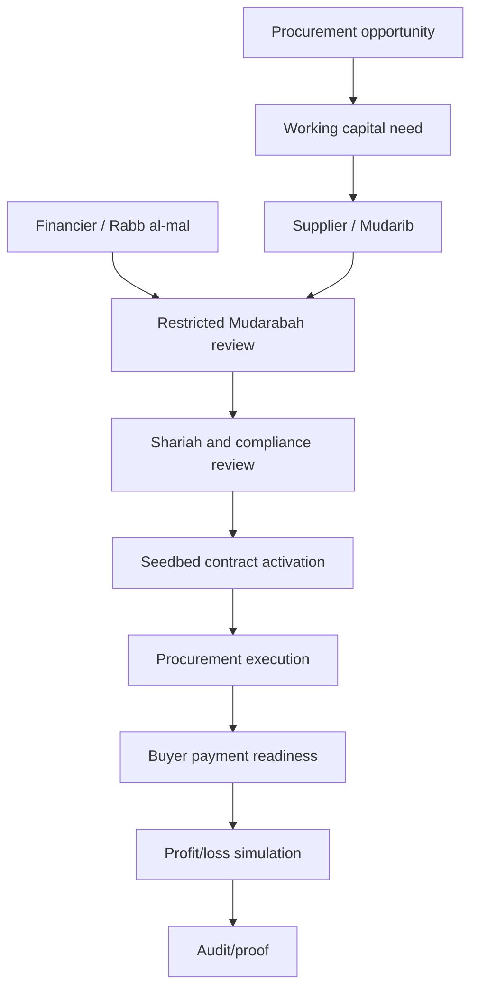

# Mudarabah Financing Tree

This tree connects the Mudarabah procurement thesis to the current PLS seedbed. It preserves the boundary that this is not formal Islamic finance certification.

| Step | Classification | Repository support | Evidence | Product-owner decision |
|---|---|---|---|---|
| Procurement opportunity | Implemented | Source-to-award, orders, organization network | `PBI-498_SOURCE_TO_AWARD_VALIDATION.md` | Keep opportunity tied to a real procurement case. |
| Working capital need | Projection/seedbed | Company ledger and PLS contract metadata | `PBI-480_MUDARABAH_WORKFLOW_PROJECTION_VALIDATION.md` | Decide whether to model financing requests as first-class records. |
| Supplier / Mudarib | Implemented actor concept | supplier role, organization node | Demo case and actor matrix | Keep supplier as operator, not guaranteed beneficiary. |
| Financier / Rabb al-mal | Implemented actor concept | financier organization and PLS APIs | `PBI-393_PLS_SHARIAH_WORKFLOW_VALIDATION.md` | Add real financier UAT before pilot claims. |
| Due diligence | Partial | KYC/AML and eligibility cases | `PBI-383_COMPLIANCE_WORKFLOW_VALIDATION.md` | Expand due diligence if financing depth is next. |
| Shariah/compliance review | Implemented within seedbed | Shariah review and certificate artifact repos | `PBI-447_SHARIAH_CERTIFICATION_ARTIFACTS_VALIDATION.md` | Keep language as artifact tracking, not certification. |
| Restricted Mudarabah contract | Implemented as seedbed | PLS contract repository | `PLS_SCENARIO_SIMULATOR_VALIDATION.md` | Clarify legal review before external use. |
| Capital release boundary | Not implemented | Payment adapter can simulate instruction only | `PBI-439_PAYMENT_ADAPTER_SANDBOX_VALIDATION.md` | Do not build real release before payment governance. |
| Procurement execution | Implemented | procurement modules | Issue 26 evidence | Deepen procurement controls first if workflow quality is priority. |
| Buyer payment | Not executed | payment instruction status only | `PBI-440_ISO20022_PAYMENT_MAPPING_VALIDATION.md` | No bank payment claim. |
| Profit/loss calculation | Seedbed/simulation | PLS scenario simulator | `PLS_SCENARIO_SIMULATOR_VALIDATION.md` | Useful for education; not accounting-grade. |
| Distribution treatment | Seedbed/simulation | PLS distribution records | financing tests/evidence | Needs real accounting and Shariah review for pilot. |
| Audit/proof | Implemented for selected hashes | proof anchor metadata | blockchain evidence | Proof validates event integrity, not financial correctness. |

## Rules Preserved

- The supplier/procurement operator is the Mudarib.
- The financier/banking entity is Rabb al-mal.
- No guaranteed profit or guaranteed principal is claimed.
- No production Islamic finance certification is claimed.
