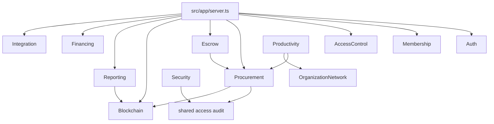

# Backend Module Tree

The backend uses Fastify with route registration in `src/app/server.ts`. Domain/application layers use ports; PostgreSQL adapters live in infrastructure.

| Module | Business purpose | Routes | Application services | Repositories | Domain types | Persistence mode | Important tests | Technical debt |
|---|---|---|---|---|---|---|---|---|
| `auth` | Credential login, bearer session, OIDC boundary | `/auth/*` | login/logout/session validation | credential and session repos | session, credential | PostgreSQL + in-memory | auth route/domain tests | OIDC not configured. |
| `membership` | Member organization governance | `/member-organizations*` | create/update org | member org repo | member org | PostgreSQL + in-memory | membership routes tests | External registry absent. |
| `access-control` | Roles and assignments | `/roles`, `/role-assignments*` | role services | roles and assignment repos | role, assignment | PostgreSQL + in-memory | access-control tests | Business role vocabulary needs grooming. |
| `shared` | Access audit/history | `/access-history*` | query/detail/sequence | access audit repo | access audit event | PostgreSQL + in-memory | 10 test files | Retention/legal hold not implemented. |
| `organization-network` | Company profile, relationships, graph, ledger, outbox | organization and network routes | graph/profile/ledger services | organization network repo | graph/profile/deal | PostgreSQL + in-memory | graph route tests | Graph is safe metadata, not production Fabric membership. |
| `kyc-aml-onboarding` | Eligibility cases and decisions | KYC/AML routes | create/decision/history | onboarding repo | onboarding case | PostgreSQL + in-memory | eligibility/status tests | Raw KYC docs are not modeled. |
| `procurement` | S2A, orders, evidence, invoices, closeout, transaction history | source-to-award, orders, evidence, invoices, closeout, transaction history | workflow services | multiple procurement repos | order/evidence/invoice/closeout/source case | PostgreSQL + in-memory | Issue 26/27 tests | Policy and catalog controls are light. |
| `escrow` | Escrow create/release/dispute lifecycle | escrow routes | create/get/transition | escrow repo | escrow | PostgreSQL + in-memory | escrow tests | No payment execution. |
| `financing` | PLS seedbed and simulator | PLS routes | contract service, simulator | PLS repo | PLS contract | PostgreSQL + in-memory | financing tests | Simulation only. |
| `shariah-review` | Review checklist and decision trail | Shariah review routes | submit/history/decision | review repo | review | PostgreSQL + in-memory | many route tests | No external board certification. |
| `shariah-certification` | Certificate artifact registry | certificate routes | certificate service | certificate repo | certificate | PostgreSQL + in-memory | route/repo tests | Artifact tracking only. |
| `blockchain` | Anchor/proof gateway and metadata | blockchain anchor routes | proof service, anchor lifecycle | anchor metadata repo + gateway port | proof metadata | PostgreSQL metadata; Fabric/in-memory gateways | anchor route/gateway tests | Production Fabric ops not certified. |
| `reporting` | Export bundle and local signing | export bundle routes | bundle/signing services | export bundle repo | export bundle | PostgreSQL + local signing adapter | reporting tests | No regulator portal/KMS. |
| `security` | Alert read model | `/security/alerts` | security alert read model | derived from source repos | alert DTO | derived from PostgreSQL sources | security alert tests | Read-only; no SIEM integration. |
| `ops` | Health/readiness/incidents | `/ops/status`, health/ready in server | readiness/incident services | incident repo | incident | PostgreSQL + in-memory | ops tests | Full observability stack absent. |
| `integration` | External API and ERP adapter foundation | `/external/*`, `/integrations/erp/*` | auth/signing/idempotency/ERP services | external credential/audit/idempotency/job repos | external client/job | PostgreSQL + local JSON adapter | integration tests | External systems not live. |
| `documents` | Document metadata, storage, extraction, signature status | `/documents*` | upload/get/extraction | document repo/storage/extraction ports | document | PostgreSQL metadata + local file adapter | document tests | No OCR/malware/legal signature service. |
| `contracts` | Negotiation and machine-readable terms | `/contracts*` | contract service/hash | contract repo | procurement contract | PostgreSQL + in-memory | contract tests | No legal redlining/signature workflow. |
| `payments` | Manual/sandbox payment instruction and ISO mapping | `/payments/instructions*` | payment service/mapper | payment repo + payment ports | payment instruction | PostgreSQL + sandbox/manual adapters | payment tests | No bank rail. |
| `productivity` | Money tracker, action inbox, views, exports | productivity routes | productivity service | state repo + derived records | productivity summary | derived; some process-local state | productivity route tests | Collaboration durability optional follow-up. |

## Module Dependency Map

