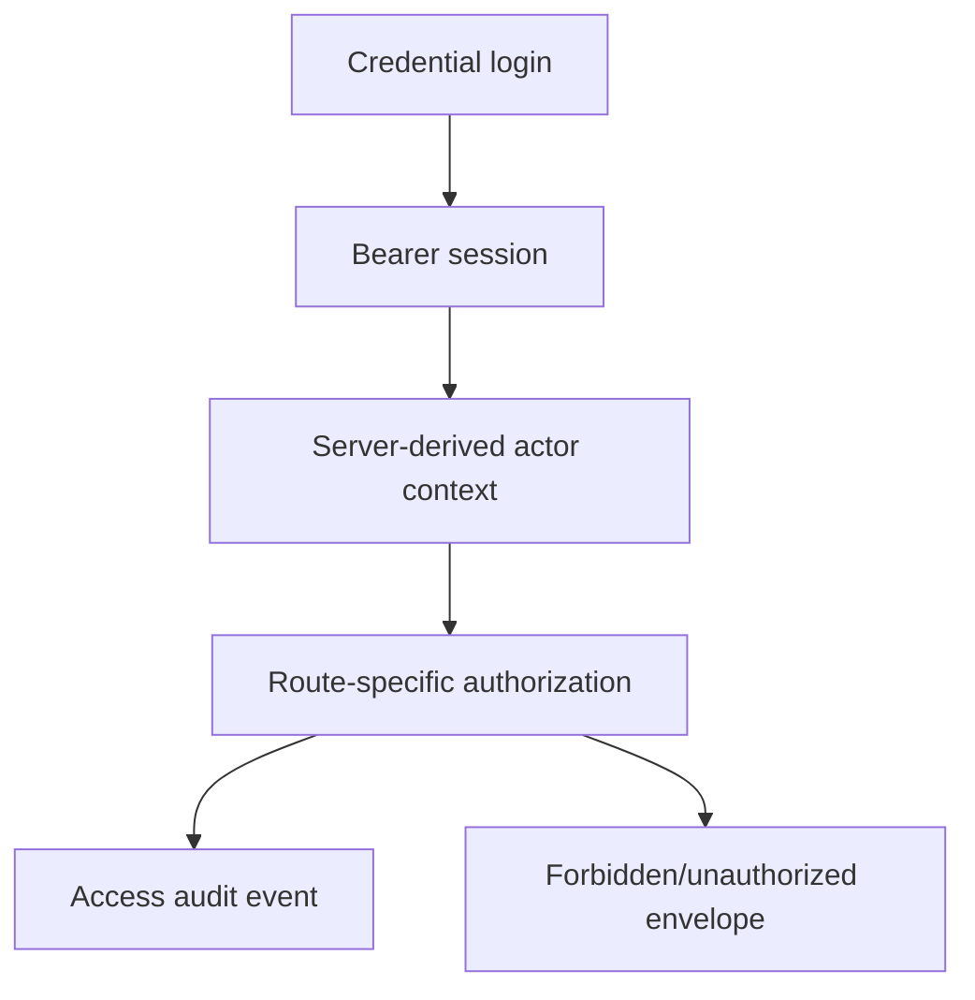

# Auth / RBAC / Permission Tree

## Current Model

- Credential login through `POST /api/v1/auth/login`.
- Opaque bearer session.
- Trusted actor context populated by backend validation.
- Product login page is credential-only and does not show role cards.
- Route-level authorization remains backend-owned.

## Role and Permission Map

| Role or actor code | Business meaning | Main capabilities | Risk / compatibility note |
|---|---|---|---|
| `administrator` | Platform governance | Members, roles, access history, many read views | Broad role; keep audited. |
| `organizationAdmin` | Company administrator | Own profile, organization users, company context | Must stay org-scoped. |
| `buyer` / `procurementOfficer` | Buyer procurement actor | Orders, source-to-award, escrow, evidence review | Should converge on business vocabulary. |
| `requestingUser` | Requisition initiator | Create need/requisition | Good for S2A depth. |
| `approverManager` | Internal approval | Approve requisition | Needs policy matrix before pilot. |
| `sourceToAwardManager` | Workflow-specific source-to-award manager | S2A actions | Added as first-class workflow role in Issue 27. |
| `quotationManager` | Supplier quotation actor | Submit quotation | Added as first-class workflow role. |
| `supplier` | Supplier organization user | Acknowledge orders, submit evidence/invoices | Must be scoped to assigned supplier org. |
| `receivingOfficer` | Receipt/evidence actor | Delivery evidence review | Partially modeled. |
| `invoiceManager` | Invoice review actor | Invoice review/match/payment readiness within scope | First-class in Issue 27. |
| `financeOfficer` | Finance/AP actor | Payment readiness and productivity | No bank execution authority. |
| `procurementCloseoutManager` | Closeout actor | Close procurement case and score supplier | First-class in Issue 27. |
| `complianceReviewer` | KYC/AML reviewer | Case decisions and eligibility | Must not expose raw documents. |
| `shariahReviewer` | Shariah governance reviewer | Review decisions/certificate artifacts | No external certification claim. |
| `financier` | Financing organization user | PLS and payment-readiness review | No guaranteed profit/principal. |
| `auditor` | Read-only evidence reviewer | Audit trail and proof | Read-only by default. |
| `regulator` | Reporting user | Export bundle and proof review | No external regulator portal. |
| `securityOperator` | Read-only security reviewer | Security alerts | No mutation capability. |
| `developer` / integrator client | API consumer | OpenAPI/external API review | External clients use scoped credentials, not user role switching. |

## Permission Tree

## Product Owner Questions

- Should compatibility labels such as `buyer` and richer labels such as `procurementOfficer` be consolidated before external pilot?
- Should approval thresholds and spend policies become configurable next?
- Should organization administrators have a separate, narrower workflow from platform administrators?
