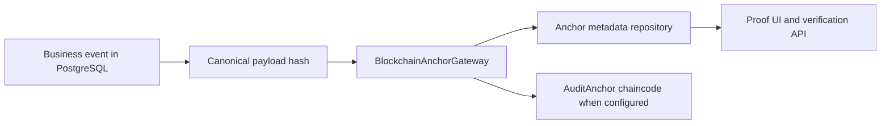

# Blockchain Proof Tree

## What Fabric/Proof Does

The repository uses blockchain proof anchoring for selected event hashes. PostgreSQL remains the operational source of truth.

## Main Components

| Component | Path | Purpose | Boundary |
|---|---|---|---|
| AuditAnchor chaincode | `chaincode/audit-anchor` | `anchorEvent`, `getAnchor`, `verifyEvent`, `listAnchorsByCase` | Proof data only. |
| Blockchain gateway port | `src/modules/blockchain/application/blockchain-anchor-gateway.ts` | Keep Fabric SDK out of application/domain | Infrastructure implements Fabric/local modes. |
| Anchor metadata repo | blockchain application/infrastructure | Store app-side anchor status | PostgreSQL metadata, not chain ledger. |
| Proof route | `/api/v1/blockchain/anchors/:eventId` | Lookup and verify proof | Must not fabricate transaction IDs. |
| Proof UI | Blockchain proof panels/timeline | Explain states to auditor/regulator | Honest pending/failed/notFound/mismatch/unavailable states. |

## What Is On-Chain

- event id
- hashed case id
- event type
- payload hash
- schema/canonicalization
- timestamp
- previous event hash where applicable

## What Is Off-Chain

- raw KYC/AML data
- commercial documents
- invoices and payment credentials
- escrow terms
- delivery images/files
- legal signature artifacts
- full transaction payloads

## Proof States

| State | Meaning |
|---|---|
| `notAnchored` | No anchor attempt. |
| `pending` | Event exists and anchor is waiting. |
| `anchored` | Anchor transaction accepted by configured gateway. |
| `failed` | Anchor attempt failed; business event remains intact. |
| `verified` | Submitted hash matches anchor. |
| `mismatch` | Event exists but hash differs. |
| `notFound` | No anchor exists for event id. |
| `unavailable` | Proof service or Fabric unavailable. |

## Evidence Level

- Local chaincode build/test: level 3 to 4.
- App-owned route regression proof: level 3.
- Production-like local Fabric lab evidence for PBI-438: level 7 for lab execution only.
- Production Fabric operation: not claimed.

## Production Fabric Requirements Still Outside Claim

- Managed CA/MSP lifecycle
- certificate rotation
- HSM/KMS-backed keys
- production endorsement policy governance
- private data collection operations
- disaster recovery
- monitoring and incident response
- multi-organization operational agreements
