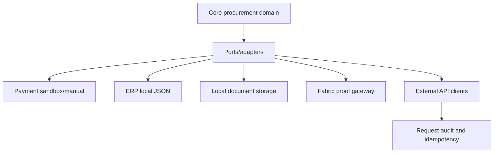

# Integration Boundary Tree

| Integration | Current adapter | Demo/local/projection/real status | Security boundary | Data boundary | Next production step |
|---|---|---|---|---|---|
| Email/outbox | Local outbox records | Local/demo | Authenticated organization context | Safe notification metadata | SMTP/provider adapter and delivery audit. |
| Payment/manual settlement | Manual and local sandbox payment adapters | Sandbox only | Authenticated route and role checks | Payment instruction metadata only | Bank sandbox, reconciliation, legal controls. |
| ISO 20022 | Deterministic JSON mapping | Mapping only | Payment route authorization | No bank submission | External bank validation and XML profile if needed. |
| ERP/accounting | Local JSON adapter | Adapter foundation | External API scopes and backend auth | Mapping artifacts, no external posting | ERP sandbox connector and UBL/Peppol profile validation. |
| External API gateway | HMAC/scoped client foundation | Local integration boundary | client id, signature, idempotency | Request audit, no raw secrets logged | Rate limiting, key rotation, external client onboarding. |
| OpenAPI/Postman | Contract + collection | Core APIs documented | Bearer session | Contract examples | Expand to all implemented route groups. |
| OAuth/OIDC | Provider boundary | `externalOidc` not configured | No production IdP | No external claims | Real IdP integration and callback validation. |
| Documents/storage/extraction | Local file storage, local extraction/signature metadata | Local adapter | Authenticated upload metadata | Raw docs off-chain/local | Object storage, malware scan, OCR, legal signature provider. |
| Fabric gateway | In-memory, disabled, unavailable, Fabric adapter | Lab/proof boundary | Fabric config explicit | Hashes/proof metadata only | Production consortium operations. |
| IoT/QR/EPCIS | External API endpoints and proof metadata | Adapter foundation | scoped external credential/HMAC | Safe proof metadata/hash only | Device PKI, EPCIS repository, logistics network validation. |

## Integration Rule

External standards are adapters and mappings. They do not replace the internal domain model.

## Boundary Diagram

