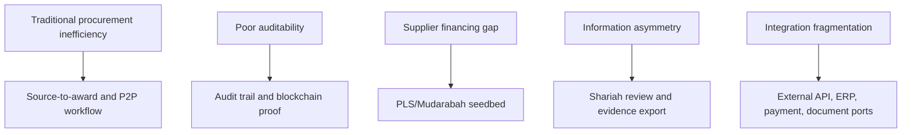

# Research Alignment Matrix

Research sources sampled:

- `C:\Users\User\Downloads\eprocurement_blockchain_ieee_paper.pdf`
- `C:\Users\User\Downloads\procurement_thesis_final.pdf`
- `C:\Users\User\Downloads\mudarabah_procurement_thesis.pdf`
- `C:\Users\User\Downloads\blockchain_hyperledger_fabric_thesis.pdf`
- `docs/report/product-diagnosis-redesign/product_diagnosis_redesign_report.tex`
- `docs/architecture/EXTENDED_PRODUCTION_ARCHITECTURE_PLAN.tex`

| Research requirement / pain point | Source document | System feature | Implementation status | Evidence | Gap | Product-owner decision |
|---|---|---|---|---|---|---|
| Traditional procurement has manual handoffs across requisition, approvals, supplier selection, PO, receipt, invoice, and payment | traditional procurement thesis; e-procurement blockchain paper | Source-to-award, orders, delivery evidence, invoice, closeout | Implemented for demo/pilot-hardening | PBI-498/499/500 evidence | Production policy and ERP/AP integration missing | Deepen procurement workflow first if product wants operational value. |
| Poor spend visibility and productivity loss | traditional procurement thesis | Productivity money tracker, company ledger | Implemented with record-backed/fallback labeling | Productivity and Issue 27 evidence | Full collaboration durability optional | Decide if finance dashboard becomes core pilot feature. |
| Maverick buying and contract leakage need controls | traditional procurement thesis | Source-to-award, contracts, RBAC | Partially implemented | contract and RBAC evidence | Budget/catalog/contract obligation controls absent | Add spend policy before pilot. |
| Invoice exceptions and duplicate payment risk | traditional procurement thesis | Invoice metadata, three-way match, payment-readiness | Implemented without bank payment | PBI-499 | No e-invoice/tax/AP integration | High-priority product depth. |
| Supplier performance feedback loop matters | e-procurement blockchain paper | Procurement closeout and supplier scorecard | Implemented | PBI-500 | Needs historical data | Build reporting depth after real data. |
| Blockchain should store hashes/events, not raw business documents | e-procurement blockchain paper; Fabric thesis | Blockchain anchor gateway and proof UI | Implemented | PBI-323, PBI-438, Issue 27 | Production Fabric ops remain | Keep current blockchain boundary. |
| Permissioned Fabric fits known multi-organization audit, privacy, endorsement needs | Fabric thesis | Fabric gateway, consortium architecture, lab guidance | Lab/foundation proven | PBI-438 evidence | Managed production consortium absent | Do not lead with production Fabric claims. |
| Private data collections/channels support selective privacy | Fabric thesis | Channel scope/proof metadata and architecture docs | Documented and partially modeled | Fabric architecture docs | No production PDC operation | Treat as future architecture, not demo claim. |
| Mudarabah links procurement opportunity, working capital need, Mudarib, Rabb al-mal, Shariah review, profit/loss | mudarabah procurement thesis | PLS seedbed, Shariah review, financier dashboard | Seedbed/simulation implemented | PBI-393, PLS simulator | No actual capital release or formal certification | Keep PLS as optional seedbed unless sponsor wants finance depth. |
| Mudarabah needs strong governance and transparent documentation due to moral hazard/information asymmetry | mudarabah procurement thesis | Audit/proof, procurement evidence, Shariah decision, certificate artifacts | Partially implemented | Shariah/PLS/proof evidence | Accounting and real governance board missing | Do not pilot PLS without external review. |
| Public contracts and procurement standards can inform interoperability | standards mapping docs | OCDS/UBL/Peppol mapping references | Documented/adapter foundation | PBI-462 and ERP evidence | No production certification | Use mappings only at integration boundary. |

## Research-to-Feature Map

